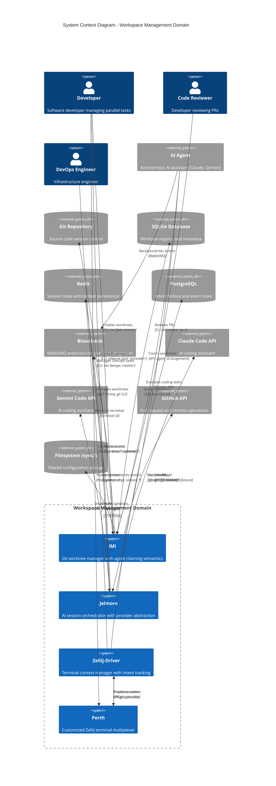

# C4 Context Level: Workspace Management Domain

## System Overview

### Short Description
The Workspace Management domain provides developers with intelligent Git worktree management, AI session orchestration, and terminal context persistence for asynchronous parallel workflows.

### Long Description
The Workspace Management domain is the execution environment where agents and developers perform their actual work. It consists of four interconnected services that work together to provide a seamless developer experience:

- **iMi** manages Git worktrees with agent claiming/releasing semantics, enabling conflict-free parallel development
- **Jelmore** orchestrates long-lived AI coding sessions (Claude, Gemini, Codex) with event-driven integration
- **Zellij-Driver** tracks developer intent and milestones across terminal sessions with Redis-backed persistence
- **Perth** provides the customized terminal multiplexer runtime based on Zellij

This domain solves the problem of coordinating multiple agents and developers working in parallel on the same codebase by providing isolated execution contexts (worktrees), persistent AI sessions, and context tracking that survives terminal restarts.

## Personas

### Developer (Human User)
- **Type**: Human User
- **Description**: Software developer working on 33GOD platform features, managing multiple tasks in parallel
- **Goals**:
  - Work on multiple features simultaneously without context switching overhead
  - Maintain persistent AI assistant sessions across terminal restarts
  - Track progress and intent across different work sessions
  - Manage Git worktrees efficiently without manual commands
- **Key Features Used**: iMi worktree management, Jelmore AI sessions, Zellij-Driver context tracking

### AI Agent (Programmatic User)
- **Type**: Programmatic User / External System
- **Description**: Autonomous AI agents (Claude, Gemini) executing development tasks through the workspace
- **Goals**:
  - Claim exclusive access to worktrees to avoid conflicts
  - Execute code generation and testing tasks
  - Persist session state across long-running operations
  - Coordinate with other agents via event bus
- **Key Features Used**: iMi worktree claiming, Jelmore session management, Bloodbank event integration

### DevOps Engineer (Human User)
- **Type**: Human User
- **Description**: Infrastructure engineer managing CI/CD pipelines and deployment workflows
- **Goals**:
  - Use dedicated worktrees for DevOps tasks (aiops, devops prefixes)
  - Manage infrastructure code in isolated environments
  - Track deployment progress and rollback states
- **Key Features Used**: iMi devops/aiops worktrees, terminal session management

### Code Reviewer (Human User)
- **Type**: Human User
- **Description**: Developer reviewing pull requests from teammates or agents
- **Goals**:
  - Quickly checkout PR branches for review
  - Test changes in isolated environments
  - Create suggestion commits on review branches
- **Key Features Used**: iMi review/pr worktrees

## System Features

### Intelligent Worktree Management
- **Description**: Create and manage Git worktrees with opinionated naming conventions and automatic setup
- **Users**: Developer, AI Agent, DevOps Engineer, Code Reviewer
- **User Journey**: [Git Worktree Management Journey](#git-worktree-management-journey)

### Real-time Worktree Monitoring
- **Description**: Track file changes and agent activities across all worktrees with live updates
- **Users**: Developer, DevOps Engineer
- **User Journey**: [Worktree Monitoring Journey](#worktree-monitoring-journey)

### AI Session Orchestration
- **Description**: Manage long-lived AI coding sessions with provider abstraction and session persistence
- **Users**: Developer, AI Agent
- **User Journey**: [AI Session Management Journey](#ai-session-management-journey)

### Terminal Context Persistence
- **Description**: Track developer intent and milestones across terminal sessions with Redis storage
- **Users**: Developer, DevOps Engineer
- **User Journey**: [Context Persistence Journey](#context-persistence-journey)

### Event-Driven Coordination
- **Description**: Integrate workspace events with Bloodbank event bus for distributed coordination
- **Users**: AI Agent
- **User Journey**: [Agent Coordination Journey](#agent-coordination-journey)

### Symlink Management
- **Description**: Automatically synchronize dotfiles and configuration across worktrees
- **Users**: Developer, DevOps Engineer
- **User Journey**: [Configuration Sync Journey](#configuration-sync-journey)

## User Journeys

### Git Worktree Management Journey
**Developer creates a feature worktree and starts development**

1. **Developer runs command**: `imi feat user-authentication`
2. **iMi checks database**: Queries SQLite registry for existing worktree
3. **iMi creates worktree**: If new, creates `feat-user-authentication/` directory with Git worktree
4. **iMi sets up environment**:
   - Creates symlinks to shared config in `sync/` directory
   - Links `.env`, `.vscode/settings.json`, etc.
5. **iMi registers worktree**: Stores worktree metadata in SQLite (path, branch, creation time)
6. **iMi changes directory**: Automatically `cd` into the new worktree
7. **Developer starts coding**: Works in isolated environment with proper configuration
8. **Developer commits and merges**: Standard Git workflow
9. **Developer removes worktree**: `imi remove feat-user-authentication` (optional)

### Worktree Monitoring Journey
**Developer monitors active worktrees in real-time**

1. **Developer starts monitor**: `imi monitor`
2. **iMi starts file watchers**: Sets up filesystem watchers for all active worktrees
3. **iMi displays dashboard**: Shows real-time view with:
   - Active worktrees by type (feat, fix, review, etc.)
   - Git status (commits ahead/behind, dirty files)
   - Recent file changes with timestamps
   - Agent activity indicators
4. **Agent makes changes**: Modifies files in `feat-api-integration/`
5. **iMi updates display**: Shows file changes and agent activity in real-time
6. **Developer reviews activity**: Monitors progress across multiple parallel workflows

### AI Session Management Journey
**Developer starts an AI coding session that persists across terminal restarts**

1. **Developer starts session**: `jelmore start claude --prompt "Implement authentication"`
2. **Jelmore creates session**: Generates unique session ID
3. **Jelmore invokes Claude**: Uses command pattern to invoke Claude Code provider
4. **Jelmore stores session state**: Persists session metadata (ID, provider, start time)
5. **Claude generates code**: Executes AI coding tasks
6. **Terminal crashes/closes**: Developer accidentally closes terminal
7. **Developer resumes session**: `jelmore start claude --session-id abc123` or `jelmore start claude --continue`
8. **Jelmore restores state**: Loads session from persistence layer
9. **Jelmore continues work**: Resumes from last checkpoint

### Context Persistence Journey
**Developer tracks intent across terminal sessions**

1. **Developer starts Zellij**: Opens Perth (Zellij) terminal multiplexer
2. **Zellij-Driver captures intent**: User records intent: "Refactor database layer"
3. **Zellij-Driver stores in Redis**: Persists intent with session ID as key
4. **Developer works on task**: Creates multiple panes, runs commands
5. **Zellij-Driver tracks milestones**: Records completed steps:
   - "Extracted database models"
   - "Created repository pattern"
   - "Updated tests"
6. **Developer closes terminal**: Session ends, but state is preserved
7. **Developer reopens later**: Starts new Zellij session
8. **Zellij-Driver restores context**:
   - Loads intent from Redis
   - Displays milestones
   - Shows previous session state
9. **Developer continues work**: Picks up where they left off

### Agent Coordination Journey
**AI agent claims worktree, executes task, and releases via events**

1. **Agent receives task**: Bloodbank event: `task.assigned` with feature details
2. **Agent claims worktree**:
   - Calls iMi API: `imi feat user-service --agent-id claude-agent-1`
   - iMi updates database: Sets `agent_id` field, marking exclusive access
3. **Agent starts Jelmore session**:
   - `jelmore start claude --session-id agent-task-123`
   - Jelmore emits event: `session.started`
4. **Agent executes task**: Generates code, runs tests
5. **Zellij-Driver tracks progress**: Stores milestones in Redis with agent prefix
6. **Agent commits work**: Git commit in worktree
7. **iMi emits event**: `worktree.commit` to Bloodbank
8. **Agent releases worktree**:
   - Updates iMi database: Clears `agent_id` field
   - Emits event: `worktree.released`
9. **Next agent claims**: Different agent can now use the worktree

### Configuration Sync Journey
**Developer updates shared configuration that propagates to all worktrees**

1. **Developer modifies config**: Updates `sync/repo/.env` file
2. **iMi detects change**: File watcher triggers on sync directory
3. **iMi updates symlinks**: Refreshes symlinks in all worktrees:
   - `trunk-main/.env` → `../sync/repo/.env`
   - `feat-api/.env` → `../sync/repo/.env`
   - `fix-bug/.env` → `../sync/repo/.env`
4. **All worktrees updated**: Configuration change immediately available everywhere
5. **Developer continues work**: No manual copying or syncing required

## External Systems and Dependencies

### Git Repository (Version Control)
- **Type**: Version Control System
- **Description**: Git repository hosting the source code
- **Integration Type**: Direct (git2 Rust library, git CLI)
- **Purpose**: iMi manages worktrees and branches within the Git repository structure

### SQLite Database
- **Type**: Embedded Database
- **Description**: Local SQLite database for worktree registry and metadata
- **Integration Type**: Direct (Rust SQLite library)
- **Purpose**: iMi stores worktree history, agent assignments, and task metadata

### Redis Cache
- **Type**: In-Memory Data Store
- **Description**: Redis server for session state and context persistence
- **Integration Type**: Direct (Redis protocol)
- **Purpose**: Zellij-Driver stores intent, milestones, and pane metadata; Jelmore may use for session caching

### Bloodbank Event Bus
- **Type**: Message Queue (RabbitMQ)
- **Description**: Central event bus for 33GOD platform integration
- **Integration Type**: Events (RabbitMQ topic exchange)
- **Purpose**:
  - iMi emits events: `worktree.created`, `worktree.commit`, `worktree.released`
  - Jelmore consumes: `agent.prompt` queue for AI task requests
  - Jelmore emits: `session.started`, `session.ended`, `code.generated`

### Claude Code API
- **Type**: AI Coding Assistant
- **Description**: Anthropic's Claude API for AI-powered code generation
- **Integration Type**: API (HTTP/REST)
- **Purpose**: Jelmore orchestrates Claude Code sessions for autonomous coding tasks

### Gemini Code API
- **Type**: AI Coding Assistant
- **Description**: Google's Gemini API for AI-powered code generation
- **Integration Type**: API (HTTP/REST)
- **Purpose**: Jelmore provides alternative AI provider for coding tasks

### Zellij Terminal Multiplexer
- **Type**: Terminal Application
- **Description**: Upstream Zellij project (Perth is a fork)
- **Integration Type**: Fork/Extension
- **Purpose**: Perth provides customized terminal multiplexer runtime for 33GOD platform

### Docker Runtime
- **Type**: Container Platform
- **Description**: Docker for running PostgreSQL, Redis, and RabbitMQ services
- **Integration Type**: Docker Compose
- **Purpose**: Development environment for Zellij-Driver dependencies

### PostgreSQL Database
- **Type**: Relational Database
- **Description**: PostgreSQL for intent history and event store (Zellij-Driver)
- **Integration Type**: Direct (PostgreSQL protocol)
- **Purpose**: Zellij-Driver stores historical intent and snapshot data (future feature)

### Filesystem (Shared Configuration)
- **Type**: File System
- **Description**: Local filesystem for `sync/` directory with shared configs
- **Integration Type**: Direct (file I/O, symlinks)
- **Purpose**: iMi manages symlinks to shared dotfiles and configuration files

### GitHub API
- **Type**: Git Hosting Platform
- **Description**: GitHub for pull request and remote repository operations
- **Integration Type**: API (gh CLI, git remote)
- **Purpose**: iMi creates PR review worktrees using `gh pr checkout`

## System Context Diagram

## Key Workflows

### Parallel Development Workflow
1. Developer creates multiple feature worktrees: `imi feat auth`, `imi feat api`
2. Each worktree is isolated with own branch and working directory
3. Shared config synced via `sync/` directory symlinks
4. Developer switches between worktrees seamlessly
5. iMi tracks all worktree activity in SQLite database

### Agent-Driven Development Workflow
1. AI agent receives task via Bloodbank: `task.assigned` event
2. Agent claims worktree: `imi feat user-service --agent-id agent-1`
3. Agent starts AI session: `jelmore start claude --session-id task-123`
4. Zellij-Driver tracks agent progress in Redis
5. Agent commits code, iMi emits `worktree.commit` event
6. Agent releases worktree for next task

### Context Preservation Workflow
1. Developer starts Zellij session in Perth terminal
2. Zellij-Driver captures initial intent: "Refactor authentication"
3. Developer works across multiple panes and layouts
4. Zellij-Driver logs milestones to Redis
5. Terminal crashes or developer closes session
6. Developer reopens Zellij, Zellij-Driver restores context
7. Developer continues work with full context history

### PR Review Workflow
1. Reviewer receives PR notification
2. Reviewer creates review worktree: `imi review 123`
3. iMi fetches PR branch using GitHub API (gh CLI)
4. iMi creates worktree with symlinked configs
5. Reviewer tests changes in isolated environment
6. Reviewer creates suggestion commits if needed
7. Reviewer removes worktree after review

## Technology Stack

### iMi (Git Worktree Manager)
- **Language**: Rust
- **Key Dependencies**:
  - `tokio` - Async runtime
  - `git2` - Git operations
  - `sqlx` / `rusqlite` - SQLite database
  - `notify` - Filesystem watching
- **Data Storage**: SQLite (local)
- **Integration**: Bloodbank (RabbitMQ events), GitHub API (gh CLI)

### Jelmore (Session Orchestrator)
- **Language**: Python
- **Framework**: FastAPI (REST API), Typer (CLI)
- **Key Dependencies**:
  - `typer` - CLI framework
  - `pydantic` - Data validation
  - `aio-pika` - RabbitMQ async client (Bloodbank integration)
  - `httpx` - HTTP client for AI APIs
- **Data Storage**: Redis (session cache, optional)
- **Integration**: Claude API, Gemini API, Bloodbank (RabbitMQ)

### Zellij-Driver (Context Manager)
- **Language**: Rust
- **Key Dependencies**:
  - `tokio` - Async runtime
  - `redis` - Redis client
  - `sqlx` - PostgreSQL client (future)
  - `serde` - Serialization
- **Data Storage**: Redis (context, state), PostgreSQL (history, future)
- **Integration**: Zellij plugin API, Bloodbank (RabbitMQ)

### Perth (Terminal Multiplexer)
- **Language**: Rust (Zellij fork)
- **Base**: Zellij upstream project
- **Customizations**: 33GOD platform integration, custom plugins
- **Integration**: Zellij-Driver (plugin interface)

## Deployment Architecture

### Local Development
- **iMi**: Installed as CLI tool via `cargo install --path .`
- **Jelmore**: Python package installed in virtualenv (`uv sync`)
- **Zellij-Driver**: Rust binary with Docker Compose for dependencies (Redis, PostgreSQL)
- **Perth**: System-wide terminal multiplexer installation

### Dependencies
- **Docker Compose**: Runs Redis (port 6382) and PostgreSQL (port 5435)
- **RabbitMQ**: External Bloodbank service (separate 33GOD component)
- **SQLite**: Embedded database in `~/.config/iMi/iMi.db`

## Security Considerations

### Worktree Isolation
- Each worktree is a separate Git working directory
- Agent claiming prevents concurrent access conflicts
- Symlinked configs ensure consistent environment

### Session Security
- AI API keys stored in environment variables (not in code)
- Session IDs are UUIDs to prevent guessing
- Redis access restricted to localhost by default

### Event Security
- Bloodbank events use authenticated RabbitMQ connections
- Event payloads validated via Pydantic schemas
- Agent identity verified via `agent_id` field

## Performance Characteristics

### iMi
- **Worktree creation**: < 1 second for new worktree
- **Monitoring**: Real-time updates with < 100ms latency
- **Database queries**: SQLite provides millisecond response times
- **Symlink operations**: Near-instant (filesystem links)

### Jelmore
- **Session startup**: Depends on AI provider API latency (1-5 seconds)
- **Event processing**: Async workers handle concurrent requests
- **Provider abstraction**: Command pattern adds minimal overhead

### Zellij-Driver
- **Context restore**: < 500ms from Redis
- **Intent tracking**: Async logging with no blocking
- **Redis operations**: Sub-millisecond for most operations

## Scalability

### Current Limits
- **iMi**: Limited by local filesystem and SQLite (thousands of worktrees)
- **Jelmore**: Limited by AI API rate limits (provider-dependent)
- **Zellij-Driver**: Limited by Redis memory (configurable, default 512MB)

### Future Scaling
- iMi could support distributed database for multi-host coordination
- Jelmore could pool AI sessions and load balance across workers
- Zellij-Driver could use PostgreSQL for archival and Redis for hot data

## Related Documentation

### Component Documentation
- [Container Documentation](./c4-container.md) - Deployment architecture and containers
- [Component Documentation](./c4-component.md) - Internal component structure

### Service Documentation
- [iMi README](/home/delorenj/code/33GOD/iMi/trunk-main/README.md)
- [iMi PRD](/home/delorenj/code/33GOD/iMi/trunk-main/docs/PRD.md)
- [Jelmore README](/home/delorenj/code/33GOD/jelmore/trunk-main/README.md)
- [Zellij-Driver Development Guide](/home/delorenj/code/33GOD/zellij-driver/trunk-main/DEVELOPMENT.md)
- [Perth Contributing Guide](/home/delorenj/code/33GOD/perth/trunk-main/CONTRIBUTING.md)

### Platform Documentation
- [33GOD Architecture](/home/delorenj/code/33GOD/docs/ARCHITECTURE.md)
- [Domain Overview](/home/delorenj/code/33GOD/docs/domains/workspace-management.md)
- [Event Infrastructure Domain](/home/delorenj/code/33GOD/docs/domains/event-infrastructure.md)

## Glossary

- **Worktree**: Git feature that allows multiple working directories for a single repository
- **Trunk**: Main branch worktree (convention: `trunk-main/`)
- **Agent Claiming**: Process where an AI agent marks a worktree as exclusively assigned
- **Session Persistence**: Ability to resume AI coding sessions after terminal restart
- **Intent Tracking**: Recording developer goals and milestones across sessions
- **Bloodbank**: 33GOD platform event bus (RabbitMQ)
- **Provider**: AI coding assistant backend (Claude, Gemini, etc.)
- **Sync Directory**: Shared configuration directory (`sync/`) with symlinks to all worktrees

## Revision History

| Version | Date | Author | Changes |
|---------|------|--------|---------|
| 1.0 | 2026-01-29 | Claude (C4 Context Agent) | Initial C4 Context documentation |

---

**Note**: This documentation follows the [C4 model](https://c4model.com/) Context level specification, focusing on the system's users (personas), external dependencies, and high-level features. For technical implementation details, refer to the Component and Code level documentation.
