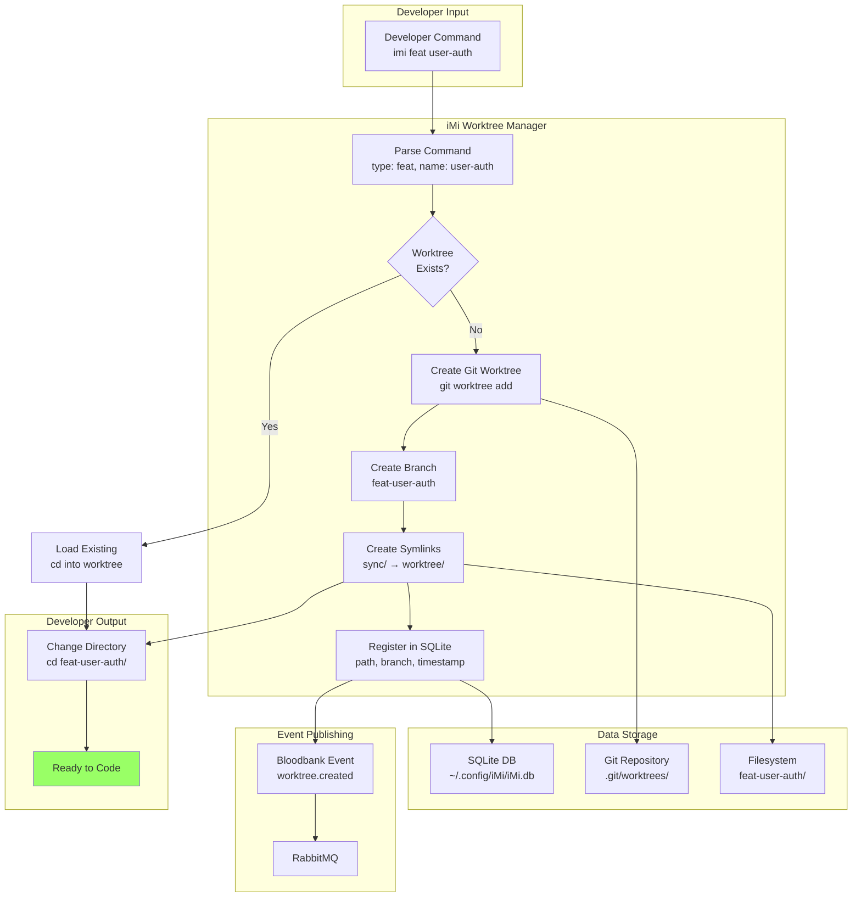
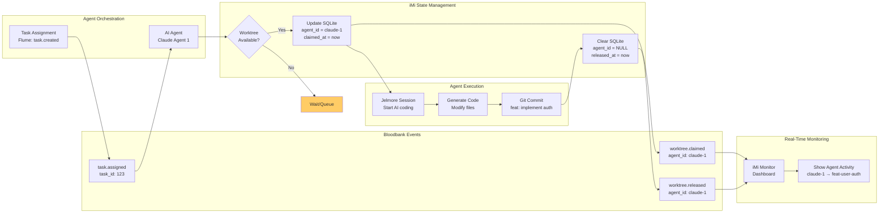
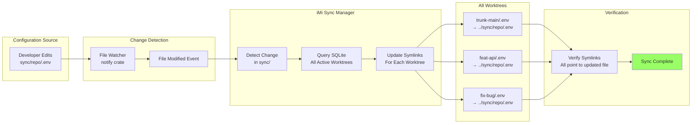

# Workspace Management Domain - Data Flows

## Overview

This document visualizes data flow patterns in the Workspace Management domain, showing how developer context, Git worktrees, AI sessions, and terminal state move through the system.

## 1. Worktree Creation and Management Flow

Shows the end-to-end flow from developer command to ready worktree.



## 2. Agent Worktree Claiming Flow

Shows how AI agents claim exclusive access to worktrees via events.



## 3. AI Session Lifecycle Flow

Detailed flow showing Jelmore session creation, execution, and persistence.

```mermaid
flowchart TB
    subgraph Start["Session Initialization"]
        StartCmd[jelmore start claude<br/>--prompt "Fix bug"]
        GenID[Generate Session ID<br/>uuid-abc123]
    end

    subgraph Provider["AI Provider Selection"]
        ProviderCmd{Provider<br/>Type?}
        Claude[Claude Code Provider]
        Gemini[Gemini Provider]
        Codex[Codex Provider]
    end

    subgraph Execution["Session Execution"]
        Invoke[Invoke AI Provider<br/>Command Pattern]
        Stream[Stream Output<br/>Real-time]
        Checkpoint[Save Checkpoints<br/>Every N messages]
    end

    subgraph Persistence["State Persistence"]
        SessionDB[Session Metadata<br/>SQLite/PostgreSQL]
        Redis[Session Cache<br/>Redis (optional)]
        Artifacts[Generated Artifacts<br/>Code files]
    end

    subgraph Events["Event Publishing"]
        StartEvent[session.started]
        ProgressEvent[session.progress]
        EndEvent[session.ended]
        RMQ[Bloodbank/RabbitMQ]
    end

    subgraph Resume["Session Resume"]
        CrashDetect[Terminal Crash]
        ResumeCmd[jelmore start<br/>--continue]
        LoadState[Load Session State]
        Continue[Continue Execution]
    end

    StartCmd --> GenID
    GenID --> ProviderCmd

    ProviderCmd -->|claude| Claude
    ProviderCmd -->|gemini| Gemini
    ProviderCmd -->|codex| Codex

    Claude --> Invoke
    Gemini --> Invoke
    Codex --> Invoke

    Invoke --> Stream
    Stream --> Checkpoint

    Checkpoint --> SessionDB
    Checkpoint --> Redis
    Stream --> Artifacts

    GenID --> StartEvent
    Checkpoint --> ProgressEvent
    Artifacts --> EndEvent

    StartEvent --> RMQ
    ProgressEvent --> RMQ
    EndEvent --> RMQ

    Invoke -.->|Unexpected Exit| CrashDetect
    CrashDetect --> ResumeCmd
    ResumeCmd --> LoadState
    LoadState --> SessionDB
    LoadState --> Redis
    LoadState --> Continue
    Continue --> Invoke

    style ProviderCmd decision
    style CrashDetect fill:#f96
```

## 4. Terminal Context Persistence Flow (Zellij-Driver)

Shows how developer intent and milestones persist across terminal sessions.

```mermaid
flowchart TB
    subgraph Session1["Session 1: Initial Work"]
        Start[Developer Opens Zellij]
        CaptureIntent[Capture Intent<br/>"Refactor database layer"]
        Work1[Create panes<br/>Edit files<br/>Run tests]
        Milestone1[Record Milestone<br/>"Extracted models"]
        Milestone2[Record Milestone<br/>"Created repositories"]
    end

    subgraph Persistence["Redis Persistence"]
        RedisWrite[Redis HSET<br/>session:{id}]
        IntentKey[intent: "Refactor..."]
        MilestonesList[milestones: [...]]
        PaneState[panes: [{layout}]]
    end

    subgraph Crash["Session Interruption"]
        Close[Terminal Closes<br/>Unexpected/Expected]
        StatePreserved[State Preserved<br/>in Redis]
    end

    subgraph Session2["Session 2: Resume"]
        Reopen[Developer Opens Zellij]
        Detect[Zellij-Driver<br/>Detects Previous Session]
        Load[Redis HGET<br/>session:{id}]
        Restore[Restore Context<br/>Display intent + milestones]
        Continue[Continue Work<br/>Full context available]
    end

    subgraph Archive["Long-Term Storage"]
        Periodic[Periodic Archival]
        Postgres[PostgreSQL<br/>Intent History]
        QueryAPI[Query API<br/>Historical intent search]
    end

    Start --> CaptureIntent
    CaptureIntent --> RedisWrite
    RedisWrite --> IntentKey

    Work1 --> Milestone1
    Milestone1 --> RedisWrite
    RedisWrite --> MilestonesList

    Milestone1 --> Milestone2
    Milestone2 --> RedisWrite

    Work1 --> PaneState
    PaneState --> RedisWrite

    Milestone2 --> Close
    Close --> StatePreserved

    StatePreserved -.->|Time Passes| Reopen
    Reopen --> Detect
    Detect --> Load
    Load --> IntentKey
    Load --> MilestonesList
    Load --> PaneState

    Load --> Restore
    Restore --> Continue

    RedisWrite -.->|Every 24h| Periodic
    Periodic --> Postgres
    Postgres --> QueryAPI

    style StatePreserved fill:#9f6
    style Restore fill:#9f6
```

## 5. Configuration Sync Flow

Shows how shared configuration propagates to all worktrees via symlinks.



## 6. Real-Time Monitoring Data Flow

Shows how file changes and agent activity flow to the monitoring dashboard.

```mermaid
flowchart TB
    subgraph Worktrees["Active Worktrees"]
        WT1[feat-api/<br/>Agent: claude-1]
        WT2[feat-ui/<br/>Agent: gemini-2]
        WT3[fix-bug/<br/>Developer: human]
    end

    subgraph Watchers["File System Watchers"]
        Watch1[notify: feat-api/]
        Watch2[notify: feat-ui/]
        Watch3[notify: fix-bug/]
    end

    subgraph Events["Change Events"]
        FileChange1[src/api.ts modified]
        FileChange2[src/App.tsx created]
        FileChange3[src/bug.rs deleted]
    end

    subgraph StateQuery["State Aggregation"]
        GitStatus[Git Status<br/>git status --short]
        AgentStatus[Agent Lookup<br/>SQLite agent_id]
        Metadata[Collect Metadata<br/>timestamp, author]
    end

    subgraph Dashboard["Monitor Dashboard"]
        Display[Real-Time Display]
        Worktree1[feat-api (claude-1)<br/>✓ 3 commits ahead<br/>• src/api.ts (2s ago)]
        Worktree2[feat-ui (gemini-2)<br/>✓ 1 commit ahead<br/>• src/App.tsx (5s ago)]
        Worktree3[fix-bug (human)<br/>⚠ 2 uncommitted<br/>• src/bug.rs (1s ago)]
    end

    WT1 --> Watch1
    WT2 --> Watch2
    WT3 --> Watch3

    Watch1 --> FileChange1
    Watch2 --> FileChange2
    Watch3 --> FileChange3

    FileChange1 --> GitStatus
    FileChange2 --> GitStatus
    FileChange3 --> GitStatus

    GitStatus --> AgentStatus
    AgentStatus --> Metadata

    Metadata --> Display
    Display --> Worktree1
    Display --> Worktree2
    Display --> Worktree3

    style Display fill:#9cf
```

## 7. Pull Request Review Workflow

Shows the data flow for PR review worktree creation and cleanup.

```mermaid
flowchart TB
    subgraph Input["Review Request"]
        PR[GitHub PR #123<br/>feat: Add authentication]
        Reviewer[Code Reviewer]
        ReviewCmd[imi review 123]
    end

    subgraph GitHubAPI["GitHub Integration"]
        GH[gh CLI]
        FetchPR[gh pr view 123<br/>--json headRefName]
        Checkout[gh pr checkout 123]
    end

    subgraph iMi["iMi Review Manager"]
        CreateWorktree[Create review-123/]
        Branch[Checkout PR branch<br/>feat-add-auth]
        SetupEnv[Symlink configs<br/>sync/ → review-123/]
        RegisterDB[Register in SQLite<br/>type: review<br/>pr_number: 123]
    end

    subgraph ReviewWork["Review Activity"]
        Test[Run Tests<br/>cargo test]
        Review[Code Review<br/>Read changes]
        Suggest[Create Commits<br/>Suggestions]
    end

    subgraph Cleanup["Post-Review Cleanup"]
        Done[Review Complete]
        RemoveCmd[imi remove review-123]
        DeleteWorktree[git worktree remove]
        UnregisterDB[Delete from SQLite]
    end

    PR --> Reviewer
    Reviewer --> ReviewCmd
    ReviewCmd --> GH
    GH --> FetchPR
    FetchPR --> Checkout

    Checkout --> CreateWorktree
    CreateWorktree --> Branch
    Branch --> SetupEnv
    SetupEnv --> RegisterDB

    RegisterDB --> Test
    Test --> Review
    Review --> Suggest

    Suggest --> Done
    Done --> RemoveCmd
    RemoveCmd --> DeleteWorktree
    DeleteWorktree --> UnregisterDB

    style Review fill:#9cf
    style Done fill:#9f6
```



## Data Flow Patterns Summary

### 1. **Command → State → Event**
- Pattern: Developer command updates local state, then publishes event
- Example: `imi feat` → SQLite insert → `worktree.created` event
- Characteristics: Event sourcing, audit trail

### 2. **File Watch → Sync → Notify**
- Pattern: File watcher detects change, syncs state, notifies monitors
- Example: sync/.env modified → update symlinks → monitor dashboard
- Characteristics: Real-time, reactive

### 3. **Session Persistence → Resume**
- Pattern: Session state continuously persisted, loaded on resume
- Example: Jelmore session → Redis cache → resume after crash
- Characteristics: Fault tolerant, stateful

### 4. **Agent Claim → Execute → Release**
- Pattern: Agent acquires lock, performs work, releases lock
- Example: Agent claims worktree → generates code → releases worktree
- Characteristics: Concurrency control, exclusive access

### 5. **Intent Tracking → Milestone → Archive**
- Pattern: Developer intent captured, milestones recorded, archived long-term
- Example: Zellij intent → Redis milestones → PostgreSQL archive
- Characteristics: Context preservation, queryable history

## Data Storage Locations

| Data Type | Storage | TTL/Retention | Purpose |
|-----------|---------|---------------|---------|
| Worktree Metadata | SQLite (~/.config/iMi/) | Indefinite | Worktree registry |
| Agent Claims | SQLite (agent_id column) | Until release | Exclusivity tracking |
| Session State | Redis (session:{id}) | 7 days | Session recovery |
| Terminal Intent | Redis (intent:{id}) | 24 hours | Context preservation |
| Intent History | PostgreSQL (future) | Indefinite | Long-term analytics |
| Generated Code | Filesystem (worktree/) | Until worktree removal | Source code |
| Shared Config | Filesystem (sync/) | Indefinite | Configuration |
| Events | RabbitMQ → PostgreSQL | Indefinite | Audit trail |

## Performance Characteristics

| Flow | Latency | Throughput |
|------|---------|------------|
| Worktree Creation | 500ms-1s | 10/sec |
| Symlink Update | 10-50ms | 100/sec |
| File Watch Event | < 100ms | Real-time |
| Session State Save | 10-50ms | Async |
| Agent Claim Check | 5-20ms | 100/sec |
| Monitor Dashboard Refresh | 100-500ms | 1 Hz |

## Related Documentation

- [Dependency Graph](./dependencies.md) - Component dependencies
- [Sequence Diagrams](./sequences.md) - Interaction patterns
- [C4 Context](./c4-context.md) - System context

---

**Version**: 1.0.0
**Last Updated**: 2026-01-29
**Maintained By**: 33GOD Architecture Team
