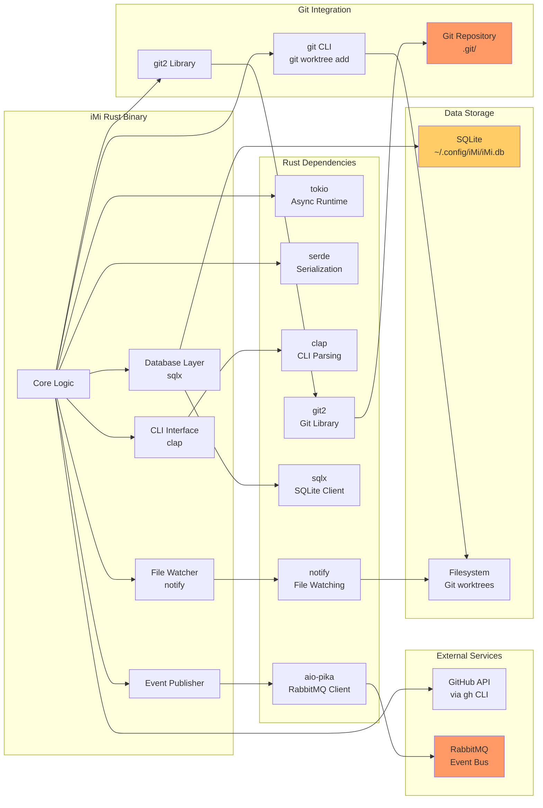
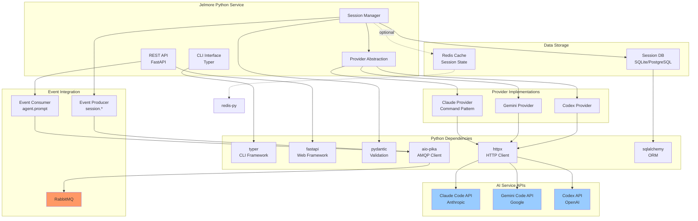
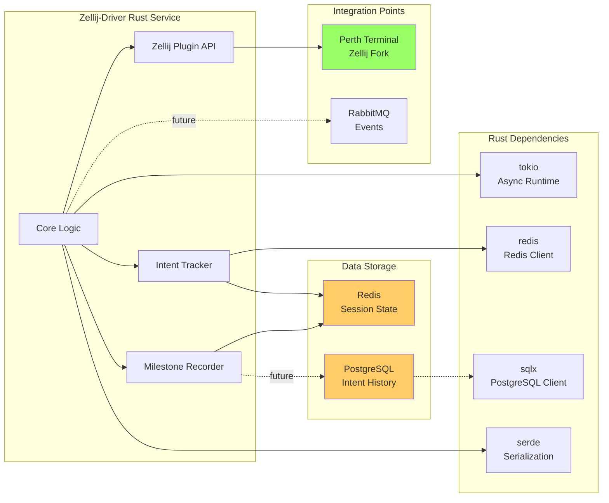
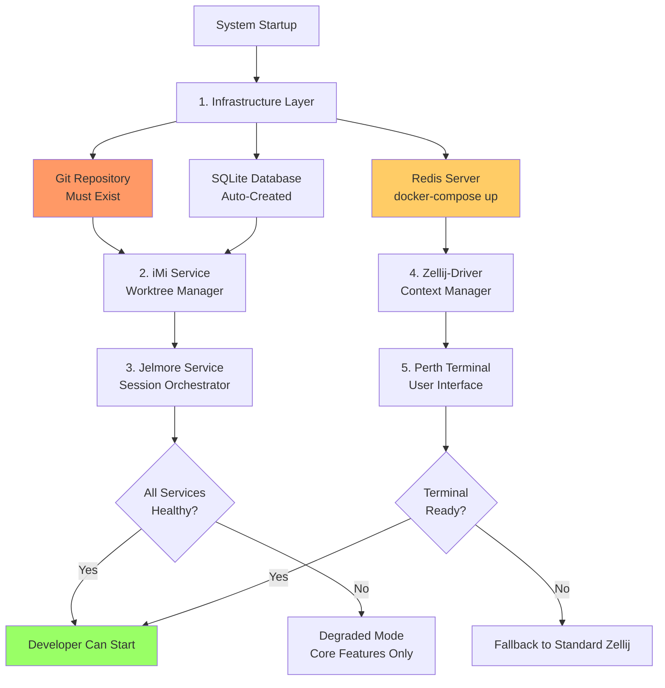
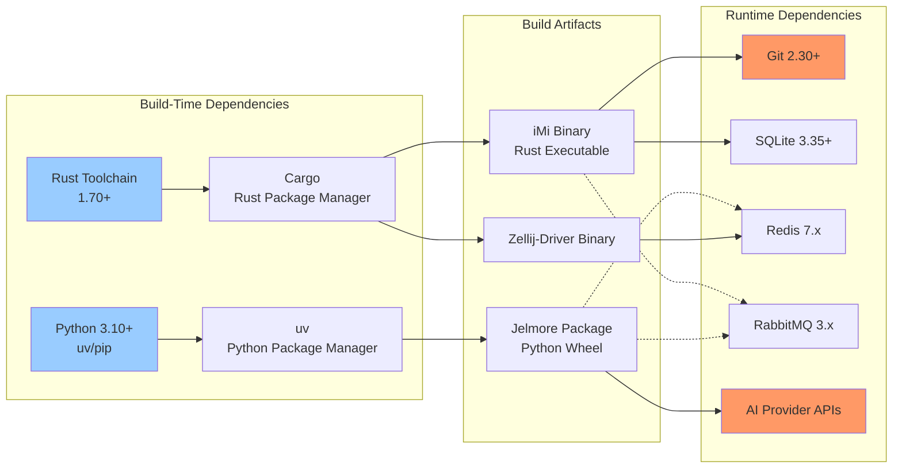

# Workspace Management Domain - Dependency Graph

## Overview

This document visualizes dependency relationships in the Workspace Management domain, showing how iMi, Jelmore, Zellij-Driver, and Perth integrate with Git, databases, and event infrastructure.

## 1. Component Dependency Overview

High-level dependencies between workspace components and external systems.

```mermaid
graph TB
    subgraph External["External Dependencies"]
        Git[Git Repository]
        RabbitMQ[RabbitMQ<br/>Bloodbank]
        SQLite[SQLite Database]
        Redis[Redis Cache]
        Postgres[PostgreSQL]
    end

    subgraph Core["Core Components"]
        iMi[iMi<br/>Worktree Manager]
        Jelmore[Jelmore<br/>Session Orchestrator]
        Driver[Zellij-Driver<br/>Context Manager]
        Perth[Perth<br/>Terminal Multiplexer]
    end

    subgraph AI["AI Providers"]
        Claude[Claude Code API]
        Gemini[Gemini Code API]
        Codex[Codex API]
    end

    subgraph Tools["CLI Tools"]
        GH[gh (GitHub CLI)]
        GitCLI[git CLI]
    end

    %% iMi dependencies
    iMi --> Git
    iMi --> SQLite
    iMi --> RabbitMQ
    iMi --> GH
    iMi --> GitCLI

    %% Jelmore dependencies
    Jelmore --> Claude
    Jelmore --> Gemini
    Jelmore --> Codex
    Jelmore --> RabbitMQ
    Jelmore -.->|optional| Redis

    %% Zellij-Driver dependencies
    Driver --> Redis
    Driver -.->|future| Postgres
    Driver --> Perth

    %% Perth dependencies
    Perth --> Driver

    %% Component interdependencies
    Jelmore -.->|uses| iMi
    Driver -.->|monitors| iMi

    style Git fill:#f96
    style RabbitMQ fill:#f96
    style SQLite fill:#fc6
    style Redis fill:#fc6
```

## 2. iMi (Worktree Manager) Dependencies

Detailed dependency graph for iMi component.



## 3. Jelmore (Session Orchestrator) Dependencies

Dependency graph showing Jelmore's provider abstraction and integration points.



## 4. Zellij-Driver Dependencies

Dependency graph for terminal context manager.



## 5. Service Dependency Matrix

Matrix showing which services depend on which infrastructure.

```mermaid
graph TB
    subgraph Services["Workspace Services"]
        S1[iMi]
        S2[Jelmore]
        S3[Zellij-Driver]
        S4[Perth]
    end

    subgraph Infrastructure["Infrastructure Services"]
        Git[Git Repository]
        SQLite[SQLite]
        Redis[Redis]
        Postgres[PostgreSQL]
        RMQ[RabbitMQ]
    end

    subgraph External["External APIs"]
        Claude[Claude API]
        Gemini[Gemini API]
        GitHub[GitHub API]
    end

    %% iMi dependencies
    S1 -->|REQUIRED| Git
    S1 -->|REQUIRED| SQLite
    S1 -->|OPTIONAL| RMQ
    S1 -->|OPTIONAL| GitHub

    %% Jelmore dependencies
    S2 -->|REQUIRED| Claude
    S2 -.->|OPTIONAL| Gemini
    S2 -->|OPTIONAL| Redis
    S2 -->|OPTIONAL| SQLite
    S2 -->|OPTIONAL| RMQ

    %% Zellij-Driver dependencies
    S3 -->|REQUIRED| Redis
    S3 -.->|FUTURE| Postgres
    S3 -->|REQUIRED| S4

    %% Perth dependencies
    S4 -->|OPTIONAL| S3

    style Git fill:#f96
    style Claude fill:#f96
    style Redis fill:#fc6
```



## 6. Startup Dependency Chain

Shows the required order of service initialization.



## Dependency Impact Analysis

### Critical Dependencies (System Fails if Unavailable)

| Service | Critical Dependency | Impact if Unavailable | Mitigation |
|---------|---------------------|----------------------|------------|
| iMi | Git Repository | Cannot create worktrees | Must be in git repo |
| iMi | SQLite | Cannot track worktrees | Database auto-created |
| Jelmore | AI Provider APIs | Cannot run AI sessions | Multiple provider fallback |
| Zellij-Driver | Redis | Cannot persist context | Graceful degradation |

### Optional Dependencies (Degraded Mode)

| Service | Optional Dependency | Feature Loss | Workaround |
|---------|---------------------|-------------|------------|
| iMi | RabbitMQ | No event publishing | Local-only operation |
| iMi | GitHub CLI | No PR review worktrees | Manual git checkout |
| Jelmore | Redis | No session caching | Slower session resume |
| Zellij-Driver | PostgreSQL | No intent history | Redis-only operation |

### External API Dependencies

| API | Service | Fallback Strategy |
|-----|---------|-------------------|
| Claude Code API | Jelmore | Switch to Gemini or Codex |
| Gemini Code API | Jelmore | Switch to Claude or Codex |
| GitHub API | iMi | Use git CLI directly |

## 7. Build-Time vs Runtime Dependencies

Separates build and runtime dependency concerns.



## Dependency Version Constraints

### Rust Dependencies (iMi, Zellij-Driver)

```toml
[dependencies]
tokio = { version = "1.35", features = ["full"] }
git2 = "0.18"
sqlx = { version = "0.7", features = ["sqlite", "runtime-tokio"] }
notify = "6.1"
serde = { version = "1.0", features = ["derive"] }
clap = { version = "4.4", features = ["derive"] }
redis = { version = "0.24", features = ["tokio-comp"] }
```

### Python Dependencies (Jelmore)

```toml
[dependencies]
typer = "^0.9.0"
fastapi = "^0.109.0"
pydantic = "^2.5.0"
aio-pika = "^9.3.0"
httpx = "^0.26.0"
sqlalchemy = "^2.0.0"
redis = "^5.0.0"
```

### System Dependencies

| Component | Minimum Version | Recommended |
|-----------|----------------|-------------|
| Git | 2.30+ | 2.43+ |
| SQLite | 3.35+ | 3.45+ |
| Redis | 6.2+ | 7.2+ |
| PostgreSQL | 13+ | 16+ |
| RabbitMQ | 3.11+ | 3.13+ |

## Circular Dependency Prevention

### Design Principles

1. **Layered Architecture**: iMi (bottom) → Jelmore (middle) → Driver (top)
2. **No Circular Imports**: Services never import each other's code
3. **Event-Driven Decoupling**: Communication via Bloodbank events, not direct calls
4. **Interface Segregation**: Depend on abstractions (SQLite schema), not implementations

### Avoided Patterns

- **Jelmore → iMi (code)**: Jelmore never imports iMi, uses CLI or events
- **Driver → Jelmore (code)**: Driver monitors but doesn't invoke Jelmore
- **iMi → Jelmore (code)**: iMi doesn't know about Jelmore, uses events

## Related Documentation

- [Data Flow Diagrams](./data-flows.md) - Data movement patterns
- [Sequence Diagrams](./sequences.md) - Interaction flows
- [C4 Context](./c4-context.md) - System context

---

**Version**: 1.0.0
**Last Updated**: 2026-01-29
**Maintained By**: 33GOD Architecture Team
