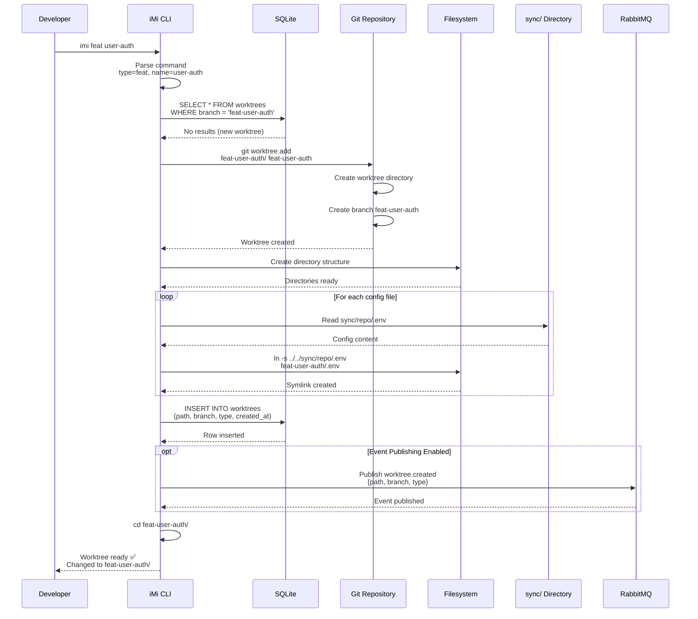
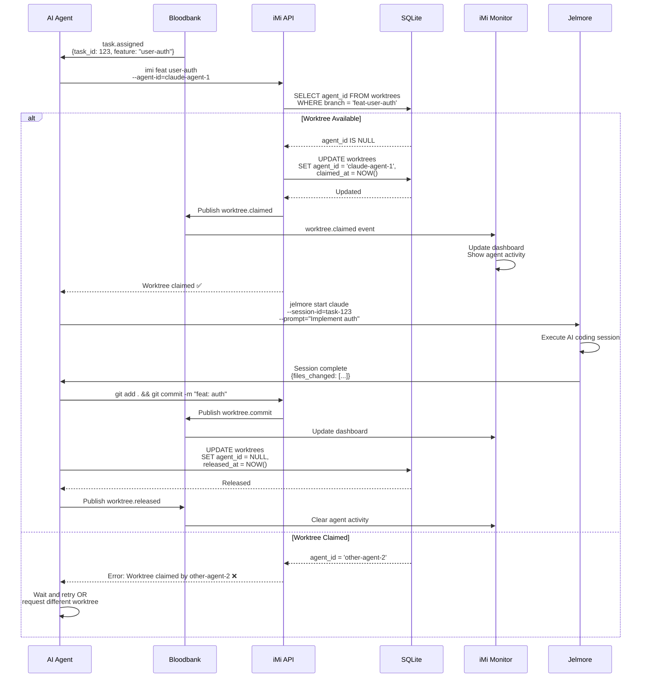
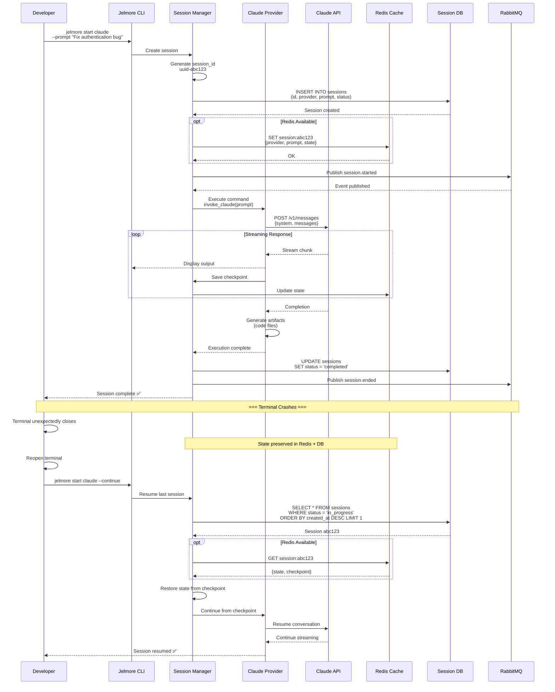
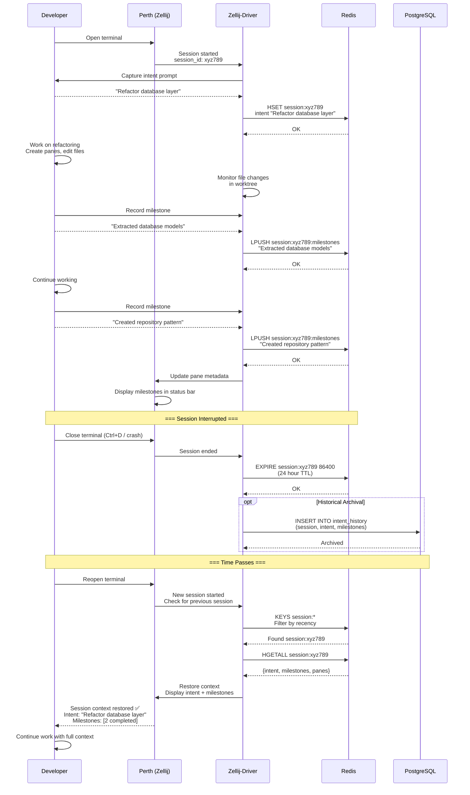
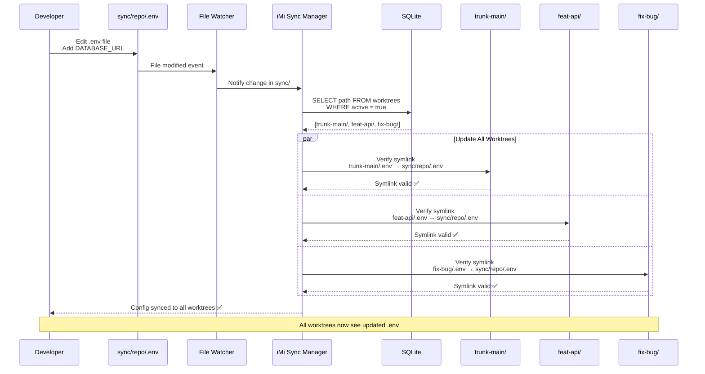
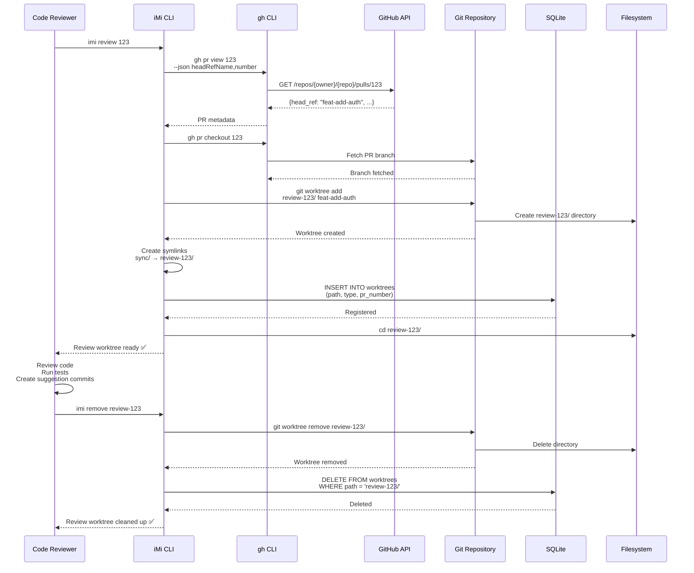
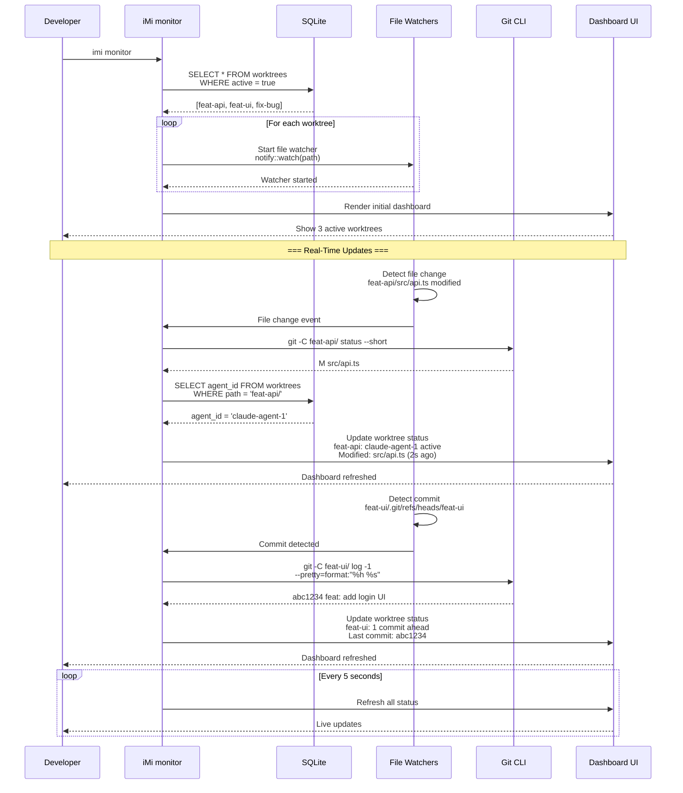
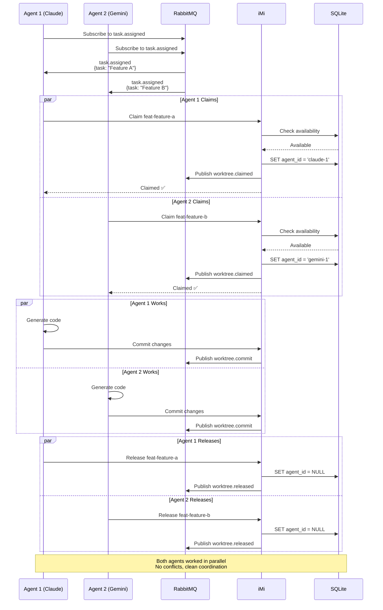

# Workspace Management Domain - Sequence Diagrams

## Overview

Detailed sequence diagrams showing interactions between workspace components, developers, and AI agents.

## 1. Worktree Creation Sequence

Complete interaction flow for creating a new feature worktree.

## 2. Agent Worktree Claiming Sequence

Shows exclusive worktree access for AI agents.

## 3. Jelmore AI Session Lifecycle

Complete session creation, execution, crash, and resume sequence.

## 4. Zellij-Driver Context Persistence

Terminal intent tracking and restoration across sessions.

## 5. Configuration Sync Across Worktrees

Real-time configuration propagation via symlinks.

## 6. Pull Request Review Workflow

Sequence for creating and cleaning up PR review worktrees.

## 7. Real-Time Monitoring Dashboard

Sequence showing how monitor dashboard aggregates live data.

## 8. Multi-Agent Coordination via Events

Shows how multiple agents coordinate worktree access via Bloodbank.

## Interaction Patterns Summary

### 1. **Synchronous Command Pattern**
- CLI command blocks until worktree ready
- Example: `imi feat` waits for git worktree creation
- Characteristics: User-friendly, immediate feedback

### 2. **Asynchronous Event Pattern**
- Agent claims worktree via events, not direct calls
- Example: `task.assigned` → claim → work → release
- Characteristics: Decoupled, scalable

### 3. **File Watch Pattern**
- React to filesystem changes in real-time
- Example: sync/ edit → detect → update symlinks
- Characteristics: Reactive, low latency

### 4. **Checkpoint/Resume Pattern**
- Continuous state persistence for crash recovery
- Example: Jelmore session interrupted → resume from checkpoint
- Characteristics: Fault tolerant, stateful

### 5. **Exclusive Lock Pattern**
- SQLite agent_id column prevents concurrent access
- Example: Agent 1 claims → Agent 2 waits
- Characteristics: Conflict-free, serialized access

## Timing Characteristics

| Sequence | Duration | Notes |
|----------|----------|-------|
| Worktree Creation | 500ms-1s | Depends on git repo size |
| Agent Claim | 10-50ms | SQLite transaction |
| Session Start | 1-5s | AI API latency |
| Context Restore | 100-500ms | Redis lookup |
| Config Sync | 50-200ms | Per worktree |
| Monitor Refresh | 100ms-1s | Real-time updates |

## Related Documentation

- [Data Flow Diagrams](./data-flows.md) - Data movement patterns
- [Dependency Graph](./dependencies.md) - Component dependencies
- [C4 Context](./c4-context.md) - System context

---

**Version**: 1.0.0
**Last Updated**: 2026-01-29
**Maintained By**: 33GOD Architecture Team
