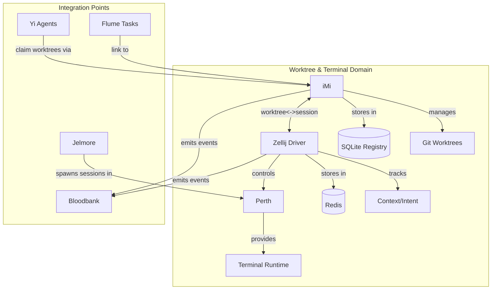

# Domain: Worktree & Terminal

> The physical execution layer. Where agents get isolated workspaces and contextual terminal sessions.

## Services

| Service | Role | Tech Stack | Status |
|---------|------|------------|--------|
| **iMi** | Decentralized git worktree manager with agent claiming semantics | Rust, Tokio, SQLite, git2-rs | Active |
| **Zellij Driver (zdrive)** | Terminal context manager for Zellij sessions | Rust, Tokio, Redis | Active |
| **Perth** | Customized Zellij terminal multiplexer distribution | Rust (Zellij fork/distro) | Active |

## High-Level Purpose

This domain manages the physical isolation and context for multi-agent development. When multiple AI agents work simultaneously on the same codebase, they need:

1. **Isolated Workspaces** (iMi) - Separate git worktrees so agents don't conflict on file changes
2. **Context Persistence** (Zellij Driver) - Track what each agent is doing, log milestones, maintain intent across sessions
3. **Unified Terminal Runtime** (Perth) - A terminal multiplexer optimized for the 33GOD workflow

The domain solves the "multi-agent contention problem" - allowing N agents to work in parallel without stepping on each other's uncommitted changes.

---

## Component Deep Dives

### iMi - Worktree Management CLI

**Purpose**: iMi manages git worktrees with agent-aware semantics. It enforces a strict directory/branch naming convention and tracks which agent owns which worktree.

**Why It Matters**: Traditional git workflows assume a single developer. When multiple agents work concurrently, they need separate working directories. iMi automates this with:
- Automatic worktree creation following naming conventions
- Agent claiming/releasing (exclusive access)
- Metadata linking to task sources (Plane, Bloodbank, Yi)
- SQLite registry for tracking state

#### Directory & Branch Naming Conventions

```
<component>/
  trunk-main/      # Main branch worktree (protected, never delete)
  feat-<name>/     # Feature worktrees
  fix-<name>/      # Bug fix worktrees
  exp-<name>/      # Experimental worktrees
```

**Examples**:
```
iMi/
  trunk-main/           # Main development line
  feat-agent-claiming/  # Feature: add agent claiming
  fix-memory-leak/      # Fix: memory leak in registry
  exp-redis-backend/    # Experiment: replace SQLite with Redis
```

#### CLI Commands

```bash
# List all projects registered with iMi
imi list

# Add a new feature worktree
imi add feat <feature-name> [--project <name>]

# Add a bug fix worktree
imi add fix <fix-name> [--project <name>]

# Claim a worktree for an agent (exclusive access)
imi claim <worktree> --agent <agent-id>

# Release a worktree (agent done working)
imi release <worktree>

# Show status of all worktrees
imi status

# Delete a worktree (after merge)
imi remove <worktree>

# Link worktree to external task (Plane, Bloodbank event)
imi link <worktree> --task <task-url>
```

#### Configuration

iMi stores its registry in SQLite at `~/.imi/registry.db`. Configuration can be customized via:

```toml
# ~/.imi/config.toml
[defaults]
base_path = "~/code"  # Where projects live
auto_claim = true     # Automatically claim on create

[branches]
main_name = "trunk-main"  # Name for main worktree
prefix_feature = "feat-"
prefix_fix = "fix-"
prefix_experimental = "exp-"

[agents]
timeout_minutes = 60  # Auto-release after inactivity
```

#### Data Model

```
Project
  - id: UUID
  - name: String
  - path: Path
  - git_url: String
  - created_at: DateTime

Worktree
  - id: UUID
  - project_id: FK(Project)
  - name: String (e.g., "feat-auth")
  - branch: String (e.g., "feat-auth")
  - path: Path
  - agent_id: Option<String>
  - claimed_at: Option<DateTime>
  - metadata: JSON (task links, etc.)
```

---

### Zellij Driver (zdrive) - Terminal Context Manager

**Purpose**: zdrive tracks intent, logs milestones, and maintains context across Zellij terminal sessions. It provides the "memory" layer for terminal-based agent work.

**Why It Matters**: Agents often work across multiple terminal sessions. Without context tracking:
- Sessions lose context on restart
- Intent gets lost between task switches
- No audit trail of what happened in each pane

zdrive solves this by storing context in Redis with per-session/per-pane granularity.

#### CLI Commands

```bash
# Initialize context for current session
zdrive init --intent "Implementing feature X"

# Log a milestone
zdrive milestone "Completed database schema"

# Set current context/intent
zdrive intent "Now working on API endpoints"

# Show current context
zdrive context

# List all milestones for session
zdrive milestones

# Export session context (for handoff)
zdrive export > context.json

# Import context (restore session)
zdrive import < context.json

# Clear context for session
zdrive clear
```

#### Context Model

```rust
struct SessionContext {
    session_id: String,        // Zellij session ID
    pane_id: Option<String>,   // Specific pane (if applicable)
    intent: String,            // Current high-level goal
    milestones: Vec<Milestone>,
    started_at: DateTime,
    last_activity: DateTime,
}

struct Milestone {
    id: UUID,
    description: String,
    timestamp: DateTime,
    metadata: HashMap<String, Value>,
}
```

#### Redis Schema

```
# Session context
zdrive:session:<session_id>         -> JSON(SessionContext)

# Intent history
zdrive:intents:<session_id>         -> LIST of intents

# Milestones
zdrive:milestones:<session_id>      -> ZSET by timestamp

# Active sessions index
zdrive:active_sessions              -> SET of session_ids

# Session-to-worktree mapping
zdrive:session_worktree:<session_id> -> worktree_id
```

#### Configuration

```toml
# ~/.zdrive/config.toml
[redis]
url = "redis://localhost:6379"
db = 0
key_prefix = "zdrive:"

[session]
auto_init = true           # Auto-initialize on new session
persist_on_exit = true     # Save context when session closes
max_milestones = 1000      # Per session limit

[integration]
imi_enabled = true         # Link to iMi worktrees
bloodbank_enabled = true   # Emit context events
```

---

### Perth - Zellij Terminal Distribution

**Purpose**: Perth is a customized distribution of the Zellij terminal multiplexer, optimized for the 33GOD multi-agent workflow.

**Why Zellij**: Unlike tmux, Zellij is written in Rust (matching the toolchain), has a plugin system, and provides better session management for programmatic control.

**Perth Customizations**:
- Pre-configured layouts for agent development
- Integration hooks for zdrive context tracking
- Custom keybindings for worktree switching
- Status bar showing current iMi project/worktree
- Color schemes matching 33GOD branding

#### Key Features

1. **Agent-Aware Layouts**: Pre-built layouts for common agent workflows
2. **Worktree Integration**: Status bar shows current iMi worktree
3. **Context Persistence**: Automatic zdrive context on session start/end
4. **Plugin Extensions**: Custom plugins for 33GOD ecosystem integration

#### Default Layout

```kdl
// ~/.config/perth/layouts/agent.kdl
layout {
    pane split_direction="vertical" {
        pane {
            name "Editor"
            size "70%"
        }
        pane split_direction="horizontal" {
            pane {
                name "Terminal"
                size "50%"
            }
            pane {
                name "Logs"
                size "50%"
            }
        }
    }
    pane size=1 borderless=true {
        plugin location="perth://status-bar"
    }
}
```

#### Keybindings

| Key | Action |
|-----|--------|
| `Ctrl+w i` | Show iMi worktree status |
| `Ctrl+w s` | Switch worktree (opens selector) |
| `Ctrl+w c` | Log milestone via zdrive |
| `Ctrl+w m` | Show milestones panel |
| `Ctrl+w e` | Export session context |

---

## Interconnections



---

## Integration with Other Domains

### Agent Orchestration Domain (Flume/Yi)

When an agent receives a task from Flume/Yi:

1. **Yi** calls `imi add feat <task-name>` to create worktree
2. **iMi** creates worktree, returns path
3. **Agent** claims worktree with `imi claim <worktree> --agent <id>`
4. **Jelmore** spawns Claude Code session in the worktree
5. **zdrive** initializes context with task intent
6. **Agent works** (milestones logged via zdrive)
7. **Agent** commits and pushes
8. **iMi** releases worktree, emits event to Bloodbank
9. **zdrive** exports context for audit trail

### Event Infrastructure Domain (Bloodbank)

Both iMi and zdrive emit events:

```yaml
# iMi Events
imi.worktree.created:
  worktree_id: UUID
  project: String
  branch: String
  agent_id: Option<String>

imi.worktree.claimed:
  worktree_id: UUID
  agent_id: String
  claimed_at: DateTime

imi.worktree.released:
  worktree_id: UUID
  agent_id: String
  duration_minutes: i32

# zdrive Events
zdrive.session.started:
  session_id: String
  intent: String
  worktree_id: Option<UUID>

zdrive.milestone.logged:
  session_id: String
  milestone: String
  timestamp: DateTime

zdrive.session.ended:
  session_id: String
  milestones_count: i32
  duration_minutes: i32
```

---

## When to Include This Context

Pass this domain to an AI agent when:

- **Git worktree questions**: "Create a worktree for feature X", "Which worktree is agent Y using?"
- **Branch/directory conventions**: "What branch should I create?", "Where does this code live?"
- **Agent workspace isolation**: "How do I avoid conflicts with other agents?", "Claim this workspace"
- **Terminal context**: "What was I working on?", "Log a milestone", "Export my session"
- **Zellij/multiplexer**: "Set up my terminal layout", "Switch worktree in terminal"
- **Session management**: "Restore my context", "What milestones did I hit?"
- **Multi-agent development**: "How do agents work in parallel?", "Coordinate workspace access"

**Trigger keywords**: worktree, branch, trunk-main, feat-, fix-, claim, release, iMi, zdrive, zellij, perth, context, milestone, session, terminal, multiplexer

---

## Common Workflows

### Workflow 1: Agent Starting a New Feature

```bash
# 1. Create feature worktree
imi add feat authentication --project myapp

# 2. Claim for this agent
imi claim myapp/feat-authentication --agent agent-claude-001

# 3. Start Perth session in worktree
cd ~/code/myapp/feat-authentication
perth --layout agent

# 4. Initialize context
zdrive init --intent "Implement JWT authentication for API"

# 5. Work... log milestones
zdrive milestone "Created User model"
zdrive milestone "Added /login endpoint"
zdrive milestone "Tests passing"

# 6. Commit, push, release
git add . && git commit -m "feat: JWT authentication"
git push origin feat-authentication
imi release myapp/feat-authentication

# 7. Context auto-exported on session end
```

### Workflow 2: Agent Handoff

```bash
# Agent 1 finishes partial work
zdrive milestone "Completed 3/5 API endpoints"
zdrive export > /tmp/handoff-context.json
imi release myapp/feat-api

# Agent 2 picks up
imi claim myapp/feat-api --agent agent-claude-002
zdrive import < /tmp/handoff-context.json
zdrive context  # Shows: "Completed 3/5 API endpoints"
```

### Workflow 3: Debugging Worktree Conflicts

```bash
# Check who owns what
imi status
# Output:
# myapp/trunk-main      [unclaimed]
# myapp/feat-auth       [claimed by: agent-claude-001, 45m ago]
# myapp/fix-typo        [unclaimed]

# Force release stale worktree (careful!)
imi release myapp/feat-auth --force

# Check all contexts
zdrive list-sessions
```

---

## Troubleshooting

### iMi Issues

| Problem | Solution |
|---------|----------|
| "Worktree already exists" | Run `imi status` to check; `imi remove` if orphaned |
| "Cannot claim - already claimed" | Check `imi status` for owner; wait or `--force` release |
| "Git error: branch exists" | The branch exists but worktree doesn't; run `git branch -d <branch>` then retry |
| "Registry locked" | Another iMi process is running; wait or remove `~/.imi/registry.db.lock` |
| "Cannot delete trunk-main" | Protected by design; never delete main worktree |

### zdrive Issues

| Problem | Solution |
|---------|----------|
| "Redis connection refused" | Ensure Redis is running: `redis-cli ping` |
| "Session not found" | Run `zdrive init` to create session context |
| "Stale context" | Run `zdrive clear` and `zdrive init` |
| "Cannot export - no milestones" | Log at least one milestone before export |

### Perth Issues

| Problem | Solution |
|---------|----------|
| "Layout not found" | Check `~/.config/perth/layouts/` for layout files |
| "Plugin failed to load" | Ensure WASM plugins are compiled; `perth plugin build` |
| "Status bar not showing worktree" | Verify iMi is installed and `imi` is in PATH |
| "Keybinding conflict" | Edit `~/.config/perth/config.kdl` to remap |

---

## Technical Quick Reference

| Component | Binary | Config Location | Data Location |
|-----------|--------|-----------------|---------------|
| iMi | `imi` | `~/.imi/config.toml` | `~/.imi/registry.db` |
| Zellij Driver | `zdrive` | `~/.zdrive/config.toml` | Redis (`zdrive:*` keys) |
| Perth | `perth` | `~/.config/perth/` | (session state in Zellij) |

### Ports & Dependencies

| Dependency | Default | Required By |
|------------|---------|-------------|
| Redis | 6379 | zdrive |
| Git | - | iMi |
| Zellij | - | Perth (runtime) |

---

## Key Files

```
/home/user/33GOD/iMi/trunk-main/
  src/
    main.rs           # CLI entry point
    commands/         # Subcommand implementations
    db/               # SQLite schema and queries
    git/              # git2-rs worktree operations
  Cargo.toml

/home/user/33GOD/zellij-driver/trunk-main/
  src/
    main.rs           # CLI entry point
    context.rs        # Session context management
    redis.rs          # Redis client and operations
    milestones.rs     # Milestone tracking
  Cargo.toml

/home/user/33GOD/perth/trunk-main/
  src/                # Zellij fork modifications
  plugins/            # Custom Perth plugins
  layouts/            # Default layout definitions
  Cargo.toml
```

---

## Last Sync

<!-- degenerate:sync-marker -->
Commit: (pending initial sync)
Date: (pending initial sync)
