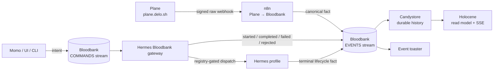
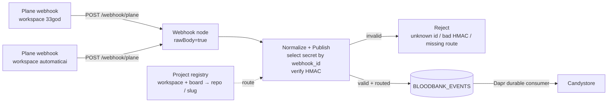
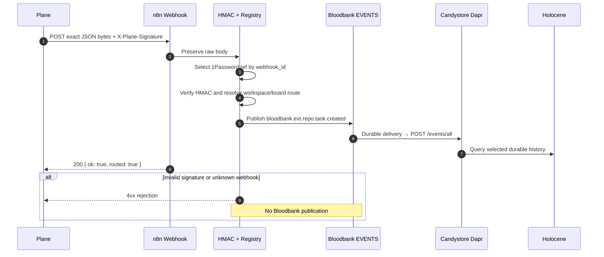
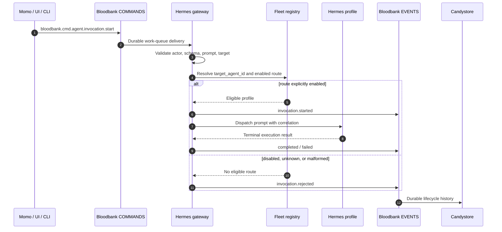

<!-- GOD-DEPS: 33god-platform,bloodbank,candystore,holocene,pjangler,hermes-fleet,momo,krebs,skillex,hindsight,n8n,plane -->

# 33GOD Event and Command Journey

This document is the root-owned map of how external facts enter 33GOD, how
commands request work, and how both become durable operator evidence. Component
repositories own their implementations; this document owns the relationships.

The editable visual source contains four canvases in one file:

- [33GOD platform context](./diagrams/33god-event-pipeline.excalidraw)
- focused Plane ingress component view;
- event/producer message trace;
- command/consumer message trace.

## The short version

Events are facts: something happened. Commands are intent: something should
happen. A command is never completion evidence. Completion becomes true only
when a correlated lifecycle event is emitted and durably stored.

## Authority boundaries

| Boundary | Authority | Explicitly not authoritative for |
|---|---|---|
| Plane | Ticket state and webhook identity | Event transport, agent execution |
| n8n `Plane → Bloodbank` | Public Plane provenance boundary, HMAC verification, normalization, project routing | Ticket state, durable event history |
| Bloodbank | Event/command schemas, subjects, and JetStream transport | Ticket truth, long-term query UX |
| Candystore | Canonical durable event-history projection | Command routing, ticket mutation |
| Holocene | Operator-facing read model, selected history, SSE | Event truth, command execution |
| Hermes Bloodbank gateway | Durable command validation, registry routing, journaling, dispatch | Permanent agent identity, event history |
| PJangler/fleet registry | Project and agent identity plus explicit route eligibility | Event transport |
| Hindsight | Project/session memory | Tickets, events, or command completion |

## Plane event ingress

The single active ingress is:

| Item | Current value |
|---|---|
| Public endpoint | `https://n8n.delo.sh/webhook/plane` |
| Workflow | `Plane → Bloodbank` |
| Workflow ID | `iMw484J1ZCqKME2C` |
| Webhook body mode | Raw body enabled |
| Signature | `X-Plane-Signature`, HMAC-SHA256 over the exact body bytes |
| Secret selection | `webhook_id` to a 1Password reference; raw secret values are not stored in Git or workflow JSON |
| Routing | Plane workspace/board identity to canonical repo/slug registry identity |
| Publisher provenance | `producer=n8n-plane-webhook`, `source=urn:33god:integration:n8n:plane-webhook` |

Both the `33god` and `automaticai` Plane workspace tenants call this same
endpoint. `automaticai` is only a tenant/routing identity on the user's
self-hosted `plane.delo.sh`; it is not a second company, service stack, trust
boundary, or infrastructure owner.

The retired port `8477` relay is not part of the path and has no listener. The
generic `/event` endpoint is a separate integration surface; Plane must use only
`/webhook/plane`.

### Event/producer trace

## Command consumption and agent dispatch

The command gateway has one durable pull consumer for
`bloodbank.cmd.agent.invocation.start`. It validates the actor, envelope,
prompt, and target; resolves `data.target_agent_id` through the fleet registry;
journals the decision; dispatches an eligible Hermes profile; and emits
correlated lifecycle facts back to the event stream.

This is deliberately default-deny. A healthy gateway does not imply that a
target is dispatchable.

## Live verification snapshot

Verified on 2026-08-27 UTC:

- Root Compose project `33god-platform` owns the running Bloodbank NATS,
  Candystore app/sidecar/PostgreSQL, event toaster, and Holocene web containers.
- `BLOODBANK_EVENTS` covers exactly `bloodbank.evt.>` — one wildcard, no
  version token in the subject at all; Candystore's durable `bloodbank.evt.>`
  subscription captures every event the stream admits.
- `BLOODBANK_COMMANDS` covers command/reply subjects with work-queue retention.
- The signed ingress integration test passed, including exact provenance and
  subject assertions.
- Candystore stored event
  `6f51892f-14c4-5883-9885-c40602fdba7b`, producer
  `n8n-plane-webhook`, workspace/slug `33god/33god`, titled
  `33GOD-38 signed ingress verification`, at
  `2026-08-27T00:10:34.187Z`.
- An invalid signature was rejected before publication.
- The gateway journal contains five historical completed commands, including
  `33god-pm` and `automatic-ai-pm`, with correlated lifecycle events.
- The current fleet registry has zero enabled Bloodbank routes. The gateway is
  active but dispatch is closed until a target route is deliberately enabled.

Historical success and present route eligibility are separate claims; both are
shown in the command trace.

## Change rule

Any change to the public webhook, raw-body handling, signature algorithm,
secret-reference selection, registry mapping, Bloodbank subject, stream policy,
durable consumer, command route gate, or lifecycle event contract must update:

1. the owning component skill and reference;
2. this root journey document and the editable Excalidraw source;
3. `33god-platform/CHANGELOG.pipeline.md` and a machine change record;
4. a live rejection test and a correlated durable-delivery proof.
