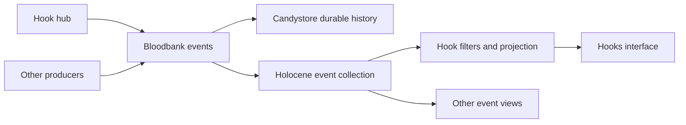

# Hooks as a Bloodbank event view

## Decision

Bloodbank distributes events. Holocene collects them, builds read projections,
and renders filtered views. Holocene does not publish domain events. The Hooks
view must not query the hook hub's HTTP API or read its receipt database.

The previous observability implementation used a direct hub API proxy and a
four-second browser poll. This follow-up replaces that path:



An HTTP event stream between Holocene's backend and its browser is presentation
traffic within the sink. It does not create another platform event producer.

## Producer contract

- `bloodbank.agent.hook.updated`: a metadata-only invocation projection,
  including handler selections, outcomes, duplicate suppression, and its
  lifecycle timeline. Original CLI lifecycle events retain their existing
  identity and publication path.
- `bloodbank.system.hook.updated`: the hub's configuration/inventory snapshot
  and subsequent liveness updates. The installed command inventory is not
  repeated with every receipt change.
- Stable hub identity and monotonically increasing revisions let consumers
  reject duplicates and older projections. Every published fact has its own
  stable CloudEvents ID.
- Receipt changes and their outgoing facts are committed together. Publication
  happens outside the interactive hook response path, retries the same event,
  and requires a JetStream acknowledgement before removing pending work.
- Existing receipt projections are backfilled through Bloodbank. Historical
  hook handlers are never executed again to rebuild observability.

## Holocene contract

The collector consumes `bloodbank.evt.>` from `BLOODBANK_EVENTS`, independently
of Candystore. Its local event store is a rebuildable read projection; Candystore
remains the canonical durable audit history. Mutable collection data lives
outside the repository.

Collection, event identity deduplication, checkpoint advancement, and projection
updates must be atomic. Reconnection resumes collection from the saved position.
Expired broker history is reported as a gap instead of silently claiming complete
history.

The generic event query and stream serve the common collection. The existing
Hooks status, history, and detail APIs query a projection of that same collection.
Browser updates are triggered by committed events, not by a polling timer.
Changing filters immediately changes the live view. Pausing freezes the view;
resuming catches it up. Repeated deliveries and successive handler outcomes keep
one row per invocation.

The shared read API exposes `/api/events`, `/api/events/status`, and
`/api/events/stream`. Queries support event type, subject, source, and a local
collection cursor. Streams resume using `Last-Event-ID`; an unavailable cursor
produces an explicit reset. Hook streams send an authoritative filtered view
on reconnection, including when the local collection has been rebuilt.

The API's collection database defaults to
`~/.local/state/holocene/events.sqlite3` (`HOLOCENE_EVENT_DB` can override it).
It connects using `BLOODBANK_NATS_URL` or `NATS_URL`, with
`nats://localhost:4222` as the default. The live API uses Node 26; the collector
requires Node 22.13 or newer for the built-in SQLite driver.

Cold collection starts at the broker's retained history boundary. It does not
silently claim events older than that boundary; Candystore retains its separate
role as the canonical audit archive. Hook receipt backfill adds the existing
hub journal's projections to the stream without repeating their effects.

## Acceptance evidence

The live collector reached 147,856 events at 21:24 EDT on September 13, with
zero rejected projections, no pending replay, and a fresh hook overview. All
eight supported CLI inventories were configured. Collected receipt counts at
that point were Claude 2,033; Codex 3,658; Copilot 3; Hermes 11; Gemini 3;
Kimi 3; OpenCode 7; Antigravity 2. OpenClaw remains explicitly unsupported.

The native invocation `29ffec36-38fa-5b9b-9001-232745df17f2` reached the event
stream in 95 ms and completed successfully. Its initial observation
`5fbdf3f0-0409-54eb-a2fc-32ab7f8fbbf8` and duplicate observation
`2fb31ba1-bb96-5b34-8388-d5d756c71775` were both retrieved from Candystore.
Reconnection from cursor 146823 replayed the duplicate observation at 146833.
The filtered API and actual browser retained one invocation row, with one
suppressed retry. The receipt inspector showed the separate lifecycle
publication, handler outcomes, and 11 timeline transitions.

While the browser was paused, invocation
`75b0a53a-cec7-53bc-87ce-aba6f2fe258b` completed in the collection and remained
absent from the rendered rows. Resuming displayed it once. The duplicate outcome
filter showed only the matching invocation. Browser network evidence contained
persistent hook streams rather than the previous four-second polling requests.

During the final six-second API outage, the hub accepted invocation
`1f239560-1d9c-55d0-981c-33f72b48445e` and its duplicate. Candystore stored
observation `4b1b2d6c-69bb-552f-89ab-c77beb1441ef` while Holocene was stopped.
The restarted collector recovered the successful invocation, with one
suppressed retry, and advanced its checkpoint from 1110026 to 1110044.
The actual browser moved from Live to Reconnecting and back to Live 7.28 seconds
after disconnection, without a refresh. It displayed the recovered invocation
once. This includes recovery after the reverse proxy returned 502 during
downtime; retries use exponential backoff capped at 30 seconds.

Older pagination entered Browsing history and displayed rows 26–50. Latest
returned to the live first page. The rendered document width was 1,480 pixels
inside a 1,495-pixel viewport, with no document overflow.

Producer checks cover 233 passing cases plus the required schema gate
(93 schemas, 89 event types, 79 native bindings). The collection/API suite has
16 passing tests, including atomic rollback, malformed nested projections,
filtered streaming, replay, growing backlog, and restart migration. The browser
stream suite has 13 passing tests, including failed reconnects and cancellation
of pending retries when paused or changing filters. API/web type checks and
the production frontend build pass. Replay yields to I/O every
25 events or 20 ms; live status requests remained 32–47 ms during catch-up.

The deployed source is pushed in Bloodbank (`2f9958b`) and Holocene
(`02e8e94`). The API runs through
`holocene-api.service`, and the frontend through the parent platform's
`holocene-web` Compose service.

The repeatable native-to-collection check is
[`scripts/verify-hooks-event-sink.py`](../scripts/verify-hooks-event-sink.py).
It creates an identifiable Codex `PreToolUse` invocation, retries its identity,
checks event-stream replay and a single projected row, and looks up the same
observation event IDs in Candystore. Run it after the collector finishes replay:

```sh
python3 scripts/verify-hooks-event-sink.py
```

The workspace-wide `git unpushed` scan also reports pre-existing and concurrent
work in other repositories, plus unrelated untracked Holocene agent files.
Those changes are preserved; the source and evidence for this delivery are
committed and pushed in their owning repositories.

This document records the follow-up to the
[CLI hook migration](hook-migration-2026-09-13.md).
