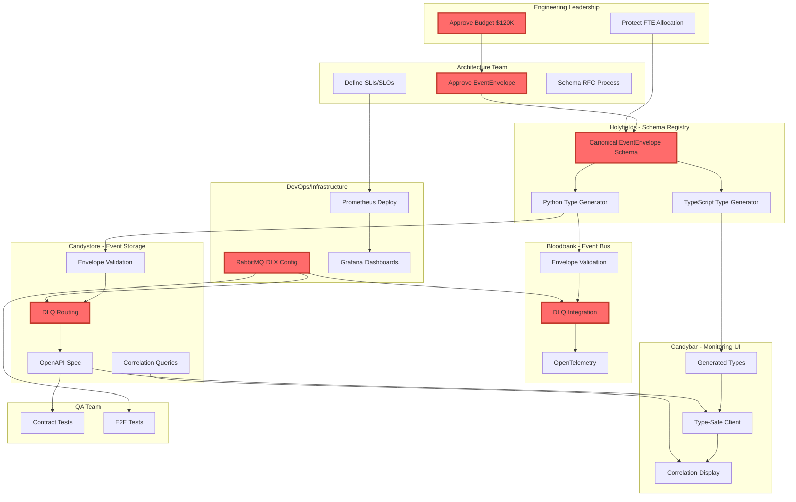

# Unified Requirements Map

## Vision Statement

**Unified Event Architecture** transforms the 33GOD ecosystem from a fragmented collection of components with 23 critical misalignments into a cohesive, schema-first event-driven platform with 99.9% availability.

### Vision Hierarchy

1. **Unified Event Architecture** (Primary) - Single source of truth for event structure
2. **Schema-First Development** (Methodology) - All types generated from Holyfields schemas
3. **Production-Ready Ecosystem** (Outcome) - Zero data loss, full traceability, 99.9% uptime

### Current State → Target State

| Metric | Current | Target | Timeline |
|--------|---------|--------|----------|
| Health Score | 42/100 | 95/100 | 8 weeks |
| Data Loss Risk | 85% in 30 days | 0% | Phase 1 (2 weeks) |
| Type Safety | 40/100 | 100/100 | Phase 2 (5 weeks) |
| Observability | 45/100 | 95/100 | Phase 3 (8 weeks) |

---

## Stakeholder Overview

| Stakeholder | Role | Critical Deliverables | Blocked By | Blocks |
|-------------|------|----------------------|------------|--------|
| **Holyfields** | Schema Registry | Canonical EventEnvelope, Type Generators | Architecture approval | All consumers |
| **Bloodbank** | Event Bus | DLQ config, Envelope validation | Holyfields schema | Candystore |
| **Candystore** | Event Storage | Validation layer, OpenAPI spec | DLQ ready, Schema | Candybar |
| **Candybar** | Monitoring UI | Generated types, Correlation display | OpenAPI spec | End users |
| **DevOps** | Infrastructure | RabbitMQ DLX, Prometheus, Grafana | Health endpoints | All teams |
| **Architecture** | Governance | Schema approval, SLIs/SLOs | None | Holyfields |
| **QA** | Quality | Contract tests, E2E tests | OpenAPI, DLQ | All teams |
| **Eng Leadership** | Sponsorship | Budget ($120K), FTE protection | None | All teams |

---

## Requirements by Domain

### 1. Schema & Type Safety

| ID | Requirement | Owner | Priority | Source |
|----|-------------|-------|----------|--------|
| S1 | Define canonical EventEnvelope structure | Holyfields | CRITICAL | CONVERGENCE_REPORT.md 5.1 |
| S2 | Create JSON Schema in Holyfields registry | Holyfields | CRITICAL | CROSS_COMPONENT_MISALIGNMENTS.md 2.1 |
| S3 | Generate Python types for Bloodbank/Candystore | Holyfields | HIGH | CONVERGENCE_REPORT.md 5.2 |
| S4 | Generate TypeScript types for Candybar | Holyfields | HIGH | CROSS_COMPONENT_MISALIGNMENTS.md 2.5 |
| S5 | Add Zod validation in Candybar | Candybar | HIGH | CROSS_COMPONENT_MISALIGNMENTS.md 2.5 |
| S6 | Add jsonschema validation in Bloodbank | Bloodbank | CRITICAL | CONVERGENCE_REPORT.md #5 |
| S7 | Add envelope validation in Candystore | Candystore | CRITICAL | CROSS_COMPONENT_MISALIGNMENTS.md 3.2 |

### 2. Message Reliability

| ID | Requirement | Owner | Priority | Source |
|----|-------------|-------|----------|--------|
| R1 | Configure RabbitMQ Dead Letter Exchange | DevOps | CRITICAL | CONVERGENCE_REPORT.md #1 |
| R2 | Implement DLQ routing in Bloodbank | Bloodbank | CRITICAL | CONVERGENCE_REPORT.md #1 |
| R3 | Never ack failed messages in Candystore | Candystore | CRITICAL | CONVERGENCE_REPORT.md #1 |
| R4 | Add retry with exponential backoff | Bloodbank | HIGH | CONVERGENCE_REPORT.md 6.1 |
| R5 | Create DLQ monitoring dashboard | DevOps | HIGH | CONVERGENCE_REPORT.md 8.4.2 |

### 3. Observability

| ID | Requirement | Owner | Priority | Source |
|----|-------------|-------|----------|--------|
| O1 | Add OpenTelemetry to Bloodbank | Bloodbank | HIGH | CROSS_COMPONENT_MISALIGNMENTS.md 4.2 |
| O2 | Add OpenTelemetry to Candystore | Candystore | HIGH | DIRECTOR_FINAL_REPORT.md 2.4 |
| O3 | Deploy Prometheus for all components | DevOps | CRITICAL | CONVERGENCE_REPORT.md 6.2 |
| O4 | Create Grafana dashboards | DevOps | HIGH | CONVERGENCE_REPORT.md 10.5.1 |
| O5 | Implement correlation chain queries | Candystore | HIGH | CROSS_COMPONENT_MISALIGNMENTS.md 3.6 |
| O6 | Display correlation chains in Candybar | Candybar | MEDIUM | CROSS_COMPONENT_MISALIGNMENTS.md 2.6 |

### 4. API & Integration

| ID | Requirement | Owner | Priority | Source |
|----|-------------|-------|----------|--------|
| A1 | Export OpenAPI specification | Candystore | HIGH | CROSS_COMPONENT_MISALIGNMENTS.md 3.5 |
| A2 | Generate TypeScript client from OpenAPI | Candybar | HIGH | CROSS_COMPONENT_MISALIGNMENTS.md 2.5 |
| A3 | Implement contract tests (Pact) | QA | HIGH | CROSS_COMPONENT_MISALIGNMENTS.md 3.5 |
| A4 | Add E2E tests for full event flow | QA | HIGH | CONVERGENCE_REPORT.md 7.1 |

### 5. Governance & Process

| ID | Requirement | Owner | Priority | Source |
|----|-------------|-------|----------|--------|
| G1 | Approve $120K budget | Eng Leadership | CRITICAL | CONVERGENCE_REPORT.md 9.1 |
| G2 | Protect 2-3 FTE for 8 weeks | Eng Leadership | CRITICAL | CONVERGENCE_REPORT.md 9.1 |
| G3 | Define schema change RFC process | Architecture | HIGH | CONVERGENCE_REPORT.md 8.1.1 |
| G4 | Establish SLIs/SLOs | Architecture | HIGH | CONVERGENCE_REPORT.md 8.4.1 |
| G5 | Create architecture review checklist | Architecture | MEDIUM | CONVERGENCE_REPORT.md 8.2 |

---

## Dependency Graph



---

## Conflict Summary

### Active Conflicts

| Conflict | Teams | Nature | Resolution | Escalation |
|----------|-------|--------|------------|------------|
| DLQ Sequencing | DevOps ↔ Candystore | Candystore can't change ack behavior until DLQ exists | DevOps configures DLQ FIRST | Eng Leadership |
| Schema Approval Speed | Architecture ↔ Holyfields | Holyfields blocked until schema approved | 1-2 day turnaround commitment | Eng Leadership |
| Feature vs Remediation | Product ↔ Engineering | $120K and 2-3 FTE diverted from features | Frame as debt payment, risk mitigation | Eng Leadership |
| Breaking Changes | All Teams | Standardization requires code changes | 90-day deprecation, dual-publish | Architecture |
| Test Environment | QA ↔ DevOps | Integration tests need RabbitMQ + PostgreSQL | Docker-compose for CI | Architecture |

### Resolved Conflicts

| Conflict | Resolution |
|----------|------------|
| Candystore field claims | QA validated: correlation_ids is plural, agent_context is persisted |
| Bloodbank jsonschema | QA validated: dependency exists (>=4.25.1) |

---

## Critical Path

The following sequence represents the minimum viable path to production-ready:

```
Week 1-2 (Phase 1: Stop Bleeding)
├── Day 1: Eng Leadership approves budget
├── Day 1: Architecture approves EventEnvelope schema
├── Day 2-3: DevOps configures RabbitMQ DLX
├── Day 3-5: Holyfields creates canonical schema
├── Day 5-7: Bloodbank implements DLQ integration
├── Day 7-10: Candystore changes ack behavior
└── Day 10-14: QA validates DLQ capture

Week 3-5 (Phase 2: Type Generation)
├── Holyfields builds Python generator
├── Holyfields builds TypeScript generator
├── Bloodbank adopts generated types
├── Candystore adopts generated types
├── Candybar adopts generated types
└── CI validates type drift

Week 6-8 (Phase 3: Observability)
├── DevOps deploys Prometheus
├── All components add OpenTelemetry
├── DevOps creates Grafana dashboards
├── Candystore implements correlation queries
├── Candybar displays correlation chains
└── QA completes E2E test suite
```

---

## Open Questions

### Requiring Immediate Decision (This Week)

| # | Question | Owner | Impact |
|---|----------|-------|--------|
| 1 | Budget approval timeline? | Eng Leadership | BLOCKING all work |
| 2 | FTE identification (who specifically)? | Eng Leadership | BLOCKING Phase 1 |
| 3 | How many architects required for schema RFC approval? | Architecture | May slow Holyfields |

### Requiring Decision (This Sprint)

| # | Question | Owner | Impact |
|---|----------|-------|--------|
| 4 | Domain naming: fireflies.* vs voice.transcription.*? | Architecture | Affects all event types |
| 5 | DLQ retention policy (24h, 7d, indefinite)? | DevOps | Storage costs |
| 6 | Breaking change deprecation timeline (30d, 90d, 180d)? | Architecture | Migration planning |
| 7 | OpenTelemetry sampling rate in prod (1%, 10%, 100%)? | DevOps | Performance vs visibility |

### Requiring Research

| # | Question | Owner | Impact |
|---|----------|-------|--------|
| 8 | WebSocket auth mechanism for Candybar? | Candybar | Security design |
| 9 | GIN index strategy for correlation_ids? | Candystore | Query performance |
| 10 | Contract test ownership model? | QA + All Teams | Maintenance burden |

---

## Success Metrics

### Phase 1 Success (After 2 weeks)
- [ ] Zero data loss on message failures
- [ ] All components use canonical EventEnvelope
- [ ] Validation catches 100% of malformed events

### Phase 2 Success (After 5 weeks)
- [ ] 100% of types generated from Holyfields
- [ ] Zero hand-written event types remain
- [ ] CI fails if types drift from schema

### Phase 3 Success (After 8 weeks)
- [ ] Full event traceability via correlation chains
- [ ] Prometheus dashboards show all SLIs
- [ ] Auto-recovery from transient failures

### Long-term KPIs (6-12 months)

| Metric | Baseline | 6-Month | 12-Month |
|--------|----------|---------|----------|
| Event Pipeline Availability | 95% | 99.9% | 99.95% |
| Mean Time to Detect | 30 min | 5 min | 1 min |
| Integration Bug Rate | 10/month | 2/month | 0.5/month |
| Feature Velocity | 10/quarter | 15/quarter | 20/quarter |

---

## Appendix: Source Documents

| Document | Purpose | Lines |
|----------|---------|-------|
| CONVERGENCE_REPORT.md | Comprehensive audit, 23 misalignments, roadmap | 1966 |
| CROSS_COMPONENT_MISALIGNMENTS.md | Technical analysis of each misalignment | 1676 |
| DIRECTOR_FINAL_REPORT.md | Executive summary | 576 |
| QA_VALIDATION_REPORT.md | Fact-checking, 82% truth factor | 545 |
| DIRECTOR_COORDINATION_LOG.md | Workflow tracking | 115 |
