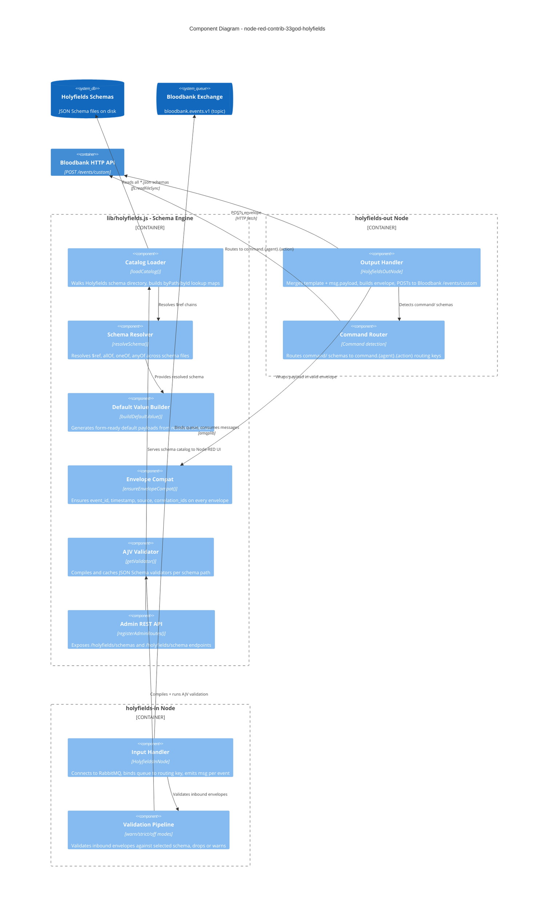

# C4 Component Diagram - Holyfields Custom Nodes

The `node-red-contrib-33god-holyfields` package is the primary integration point between Node-RED and Bloodbank. It provides palette nodes for schema-aware event publishing and consuming.

## holyfields-out Publish Flow

1. Node receives `msg` with optional `msg.payload`, `msg.envelope`, `msg.schemaPath`
2. Loads schema details from catalog (if schemaPath set)
3. Merges template payload with `msg.payload` via deep merge
4. For `command/envelope.v1.json`: auto-routes to `command.{target_agent}.{action}`
5. Wraps in envelope with `ensureEnvelopeCompat()` (event_id, timestamp, source, etc.)
6. POSTs to Bloodbank HTTP API at `/events/custom`

## holyfields-in Subscribe Flow

1. Connects to RabbitMQ via `amqplib`
2. Declares/asserts queue (named or auto-generated)
3. Binds queue to exchange with routing key pattern
4. For each message: parses JSON, optionally validates against schema
5. Validation modes: `warn` (log + forward), `strict` (drop invalid), `off` (no validation)
6. Emits `msg` with `payload` (envelope or payload-only) + `holyfields.validation` metadata

## Vetted Schema Paths

The catalog distinguishes "vetted" schemas (production-ready) from the full set:

- `agent/heartbeat.v1.json`
- `fireflies/transcript/upload.v1.json`, `ready.v1.json`, `processed.v1.json`, `failed.v1.json`
- `session/thread/*` schemas
- `artifact/audio/detected.v1.json`
- All `command/*` schemas (auto-vetted)
