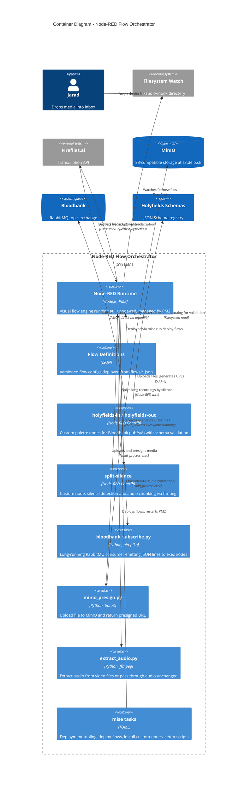

# C4 Container Diagram - Node-RED Flow Orchestrator

Shows the deployable units that make up the Node-RED Flow Orchestrator and how they interact with external systems.

## Container Inventory

| Container | Technology | Runtime | Purpose |
|-----------|-----------|---------|---------|
| Node-RED Runtime | Node.js | PM2 at `~/.node-red` | Visual flow execution engine |
| Flow Definitions | JSON | `flows/*.json` | Versioned source-of-truth for flow configs |
| holyfields-in/out | Node-RED Contrib (JS) | Loaded into Node-RED | Bloodbank pub/sub with Holyfields schema validation |
| split-silence | Node-RED Contrib (JS) | Loaded into Node-RED | Silence detection + audio chunking (ffmpeg) |
| bloodbank_subscribe.py | Python + aio-pika | exec node (long-running) | RabbitMQ consumer bridge for Node-RED |
| minio_presign.py | Python + boto3 | exec node | S3 upload + presigned URL generation |
| extract_audio.py | Python + ffmpeg | exec node | Video-to-audio extraction |
| mise tasks | TOML + shell scripts | CLI | Deployment and management tooling |

## Deployment Notes

- Node-RED runtime lives at `~/.node-red`, managed by PM2
- Flow source-of-truth is `flows/*.json` in this repo, deployed via `mise run deploy-flows`
- Custom nodes are installed via `mise run install-custom-nodes` (npm link into `~/.node-red`)
- Python scripts run in a venv at `scripts/.venv` (managed by `mise run setup-scripts`)
- Two long-running subscriber processes are started via `start-subscribers.sh`
