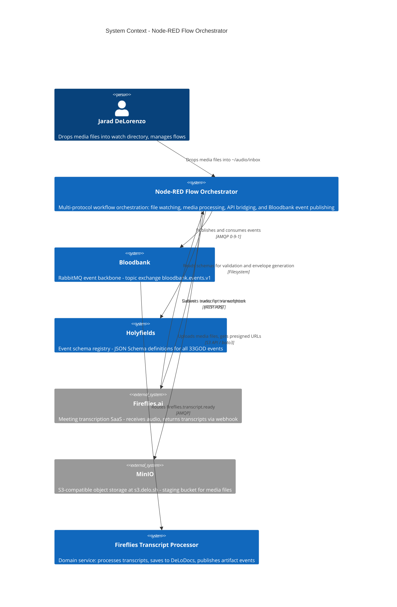

# C4 System Context - Node-RED Flow Orchestrator

The Node-RED Flow Orchestrator is the multi-protocol integration layer of the 33GOD ecosystem. It bridges filesystem events, external APIs, and Bloodbank (RabbitMQ) into unified event-driven workflows.

## Key Relationships

| From | To | Protocol | Purpose |
|------|----|----------|---------|
| User | Node-RED | Filesystem | Drop media into watch directory |
| Node-RED | MinIO | S3 API | Upload media, generate presigned URLs |
| Node-RED | Fireflies | REST | Submit audio URL for transcription |
| Fireflies | Node-RED | HTTP webhook | Deliver completed transcript |
| Node-RED | Bloodbank | AMQP | Publish `fireflies.transcript.upload`, `fireflies.transcript.ready` |
| Node-RED | Holyfields | Filesystem | Load schemas for validation and form generation |
| Bloodbank | Downstream | AMQP | Route events to domain-specific consumers |

## Architectural Role

Node-RED acts as the **integration glue** between external systems and the 33GOD event backbone. It owns the multi-protocol orchestration (filesystem, ffmpeg, S3, HTTP, AMQP) while domain-specific processing lives in dedicated services downstream of Bloodbank.
