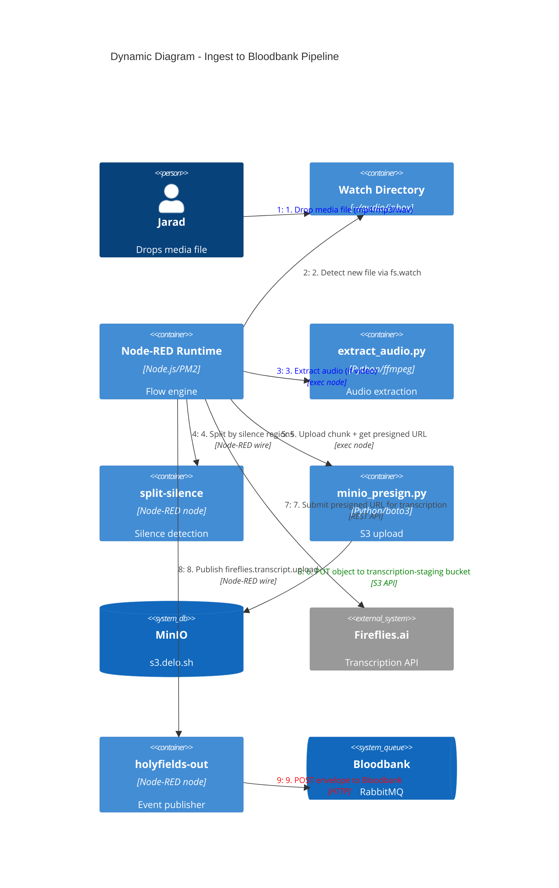
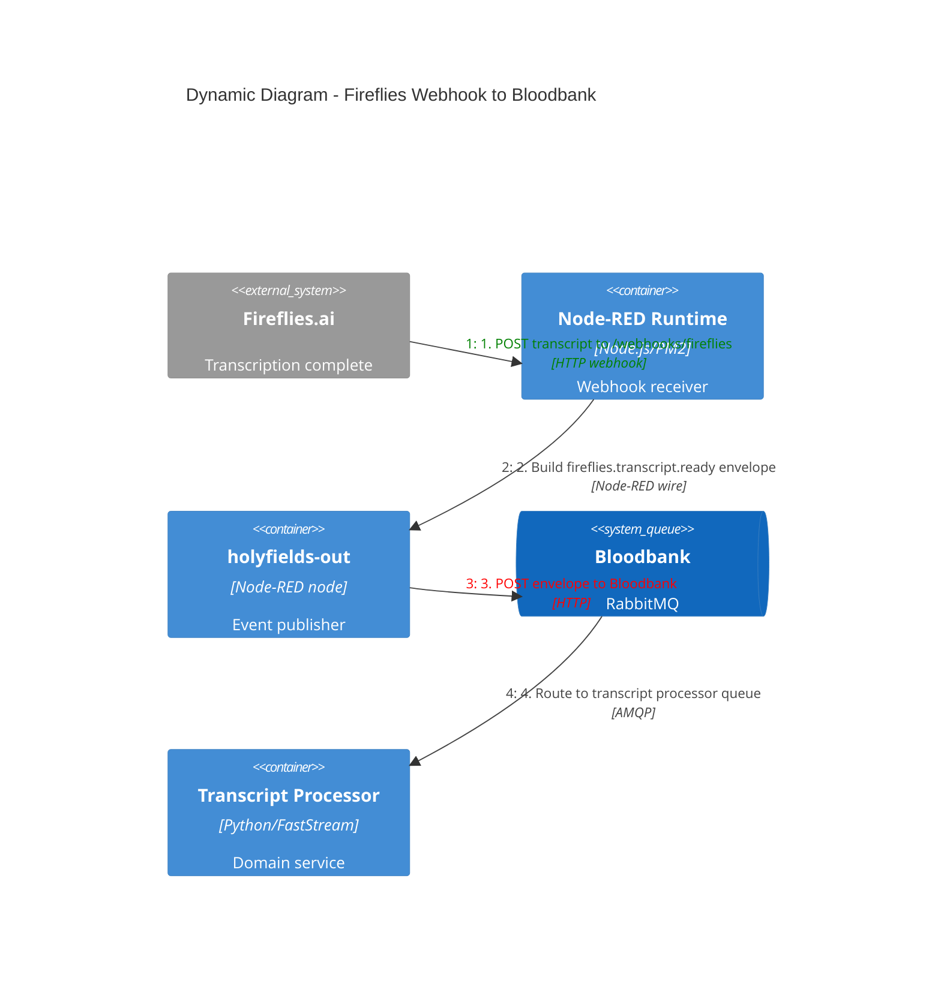

# C4 Dynamic Diagram - Media Ingest to Transcription Flow

The primary workflow: a media file dropped into the inbox is processed through audio extraction, uploaded to MinIO, submitted to Fireflies for transcription, and the resulting transcript is published to Bloodbank.

## Webhook Return Path

## Flow Steps Detail

### Ingest Pipeline (Tab 1: "Ingest -> Bloodbank")

| Step | Node Type | Action | Failure Mode |
|------|-----------|--------|-------------|
| 1 | watch | Detect new file in `~/audio/inbox` | Inotify limit; restart Node-RED |
| 2 | switch | Filter: only media extensions (mp3/wav/m4a/mp4/mov/mkv) | Non-media silently dropped |
| 3 | switch | Filter: only `rename` events (debounce) | Duplicate events filtered |
| 4 | delay | 2s settle time for large file writes | N/A |
| 5 | exec | `extract_audio.py` - extract audio if video | ffmpeg not installed; timeout 60s |
| 6 | split-silence | Detect silence gaps, split into activity chunks | ffprobe/ffmpeg failure |
| 7 | exec | `minio_presign.py` - upload chunk + presign | Missing creds; MinIO down |
| 8 | http request | POST to Fireflies upload API | API key invalid; rate limit |
| 9 | holyfields-out | Publish `fireflies.transcript.upload` to Bloodbank | Bloodbank HTTP API down |

### Webhook Return Path

| Step | Node Type | Action |
|------|-----------|--------|
| 1 | http in | Receive POST at `/webhooks/fireflies` |
| 2 | function | Extract transcript data, build payload |
| 3 | holyfields-out | Publish `fireflies.transcript.ready` to Bloodbank |

## Events Produced

| Event | Schema | Trigger |
|-------|--------|---------|
| `fireflies.transcript.upload` | `fireflies/transcript/upload.v1.json` | Media uploaded to MinIO, submitted to Fireflies |
| `fireflies.transcript.ready` | `fireflies/transcript/ready.v1.json` | Fireflies webhook delivers completed transcript |
